# Design Doc: SaaS不正検知 評価基盤アーキテクチャ

## 1. 目的

このドキュメントは、SaaS における不正利用やスパム的な挙動を検知するために、検知ルールやMLモデルを継続的に育てる評価基盤の設計を整理するものである。

ここでいう評価基盤は、運用上の対応処理そのものではない。評価基盤の役割は、reviewer による判断から作ったラベル、合成データ、将来的には運用側で記録された score results などを使い、scoring function / ruleset / ML model がどの程度よく働くかを測り、改善につなげることである。

運用スコアリング設計書が「評価済みの scorer をどのようにアプリケーション、review queue、action worker へ接続するか」を扱うのに対して、このドキュメントは「そもそも scorer をどう評価し、どう改善していくか」を扱う。

評価基盤の中心は、次の流れである。

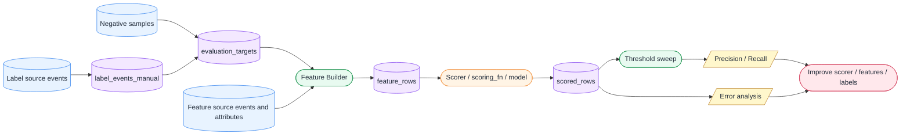

この文書は、実データ、実テーブル名、credential、実運用の閾値を含まない。学習プロジェクトに移植可能な抽象度で記述する。

---

## 2. 背景

不正検知のモデル育成で最初に混乱しやすいのは、「モデルを作ること」と「モデルを評価できる状態を作ること」を同じものとして扱ってしまう点である。

最初に重要なのは高度なモデルではない。まず必要なのは、どの対象が、どの時点で、どのような特徴量を持ち、その時点の reviewer による判断と照らして、scoring logic がどの程度うまく判定できたかを再現できることである。

このため、評価基盤の最小単位は次のように考える。

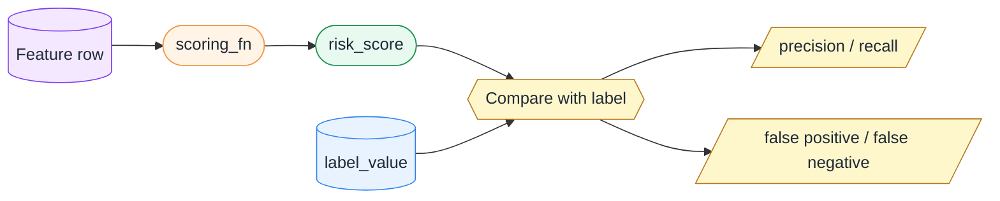

`scoring_fn` の中身は、最初はルールベースでよい。対象の作成直後、短時間の活動量、状態変更の頻度、失敗イベント数などに重みを与え、0から100の risk score を返すだけでもよい。

重要なのは、その scoring function を過去データや合成データに繰り返し適用し、threshold を動かしながら precision / recall を観察できることである。この評価の仕組みがなければ、ルールやモデルを改善しても、それが本当に良くなったのか判断できない。

---

## 3. 評価基盤が解く問題

評価基盤が解く問題は、単に「モデルの精度を見る」ことではない。

不正検知の運用では、検知ロジックは一度作って終わりではない。攻撃者の行動は変化し、正常対象の使われ方も変わり、プロダクト仕様や導線も変化する。ある時点では有効だったルールが、数週間後には誤検知を増やすかもしれないし、逆に新しい攻撃パターンを見逃すかもしれない。

そのため評価基盤は、「この scorer はどの評価期間でどれくらい当たったのか」「threshold を上げると precision はどれくらい上がり、recall はどれくらい下がるのか」「false positive になった対象はどんな特徴を持っているのか」「false negative になった対象にはどの特徴が足りなかったのか」「先週は良かったが今週は悪い、というドリフトは起きていないか」といった問いに答えられる必要がある。

このような問いに答えるために、評価基盤は label、feature、score、metrics、error analysis を分離して扱う。

---

## 4. 設計原則

### 4.1 Scoring Function は小さく保つ

評価基盤の中心には、feature row を受け取り risk score を返す関数がある。この関数はできるだけ純粋関数として扱う。つまり、DBに接続せず、ファイルを読まず、ネットワークAPIを呼ばず、label を見ない。

評価基盤では、scoring function の中身はブラックボックスとして扱える。中身が手書きルールであっても、logistic regression であっても、保存済みのMLモデルであっても、評価側から見れば同じである。

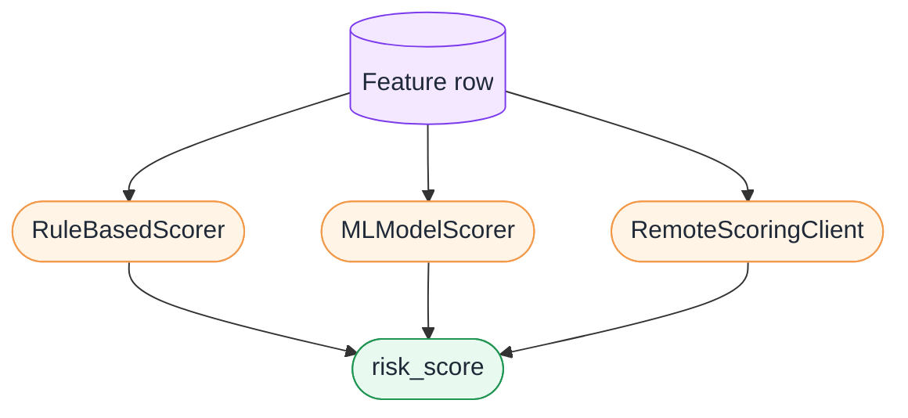

この境界を守ることで、評価基盤は scorer の中身に依存しすぎず、複数の候補を比較できるようになる。

### 4.2 Label と Feature を混ぜない

不正検知の評価で重要なのは、label と feature を分けることである。label は「この対象は、この時点で、reviewer により不正と判断された」という教師データである。一方、feature は「その時点までに観測できた行動や属性」である。

この2つを混ぜてしまうと、評価が壊れる。たとえば、対応済みという状態を特徴量に入れてしまうと、それは答えを見てから予測しているのと同じになる。これを data leakage と呼ぶ。

評価基盤では、label は評価時にのみ使う。scoring function は label を見ない。

### 4.3 as_of_time を中心にする

不正検知では、同じ対象でも時点によって状態が変わる。昨日は怪しくなかった対象が、今日になって短時間に多くのイベントを発生させているかもしれない。逆に、ある時点では怪しかったが、その後 reviewer が確認して問題ないと判断されたかもしれない。

そのため、評価では常に `entity_id + as_of_time` を持つ。これは「この対象を、この時点で見えていた情報だけで評価する」という意味である。

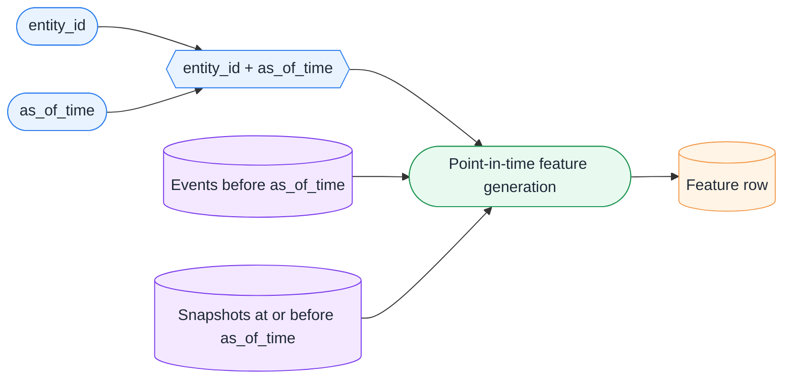

feature row は、`as_of_time` より前の情報だけを使って作る。`event_time < as_of_time` や `snapshot_time <= as_of_time` の条件を守ることで、未来の行動や後から更新された属性を誤って使うことを防ぐ。

### 4.4 Feature は都度 recompute できるようにする

判定イベントが発生した時点で、`activity_count_24h` や `event_count_1h` のような集計値を焼き込んでしまうと、後から特徴量定義を変えにくくなる。

直近24時間ではなく直近12時間を見たい、単純なイベント数ではなく unique target 数を見たい、状態変更後10分以内の活動だけを見たい、という改善は自然に起きる。そのため、判定イベントには特徴量を保存しない。判定イベントは label source として使い、特徴量は評価時に raw event / activity log / attribute snapshot から `as_of_time` 起点で recompute する。

---

## 5. データの論理ロール

物理的なテーブル名と、評価基盤上の役割は分けて考える。

たとえば、ある架空のイベントソースが `raw_domain_events` と呼ばれていたとしても、その中には reviewer decision、対象活動、システム生成イベントが混ざっている可能性がある。したがって、`raw_domain_events` 全体を label source と呼ぶのではなく、その中のどのイベントをどのロールとして使うかを明示する。

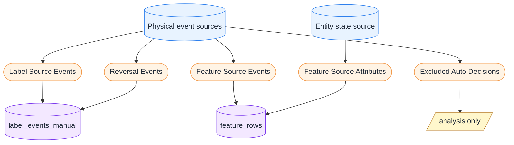

評価基盤では、reviewer による判定や取り消しなどを label source events として扱い、対象の活動や属性 snapshot を feature source として扱う。自動判定の結果は、分析対象にはできるが、教師ラベルには混ぜない。

---

## 6. Label Events

`label_events_manual` は、特徴量DBではなくラベル台帳である。これは「この対象は、この時点で、reviewer によりこの種別と判断された」という事実を正規化して保持するためのものだ。

最小構造は、`label_event_id`、`entity_id`、`label_type`、`label_value`、`as_of_time`、`source_event_id`、`source_payload`、`is_reversed`、`created_at` のようになる。ここで `label_value = 1` は、たとえば `is_abuse` の正例を意味する。

重要なのは、ここには `activity_count_24h` や `event_count_1h` のような特徴量を入れないことである。特徴量は後段で feature builder が作る。

教師データの正例は、原則として reviewer の判断から作る。自動判定結果をそのまま teacher label に混ぜると、自己参照ループが起きる。既存の判定ロジックが選んだものを正例として学習し、その結果として既存ロジックの癖をさらに強化してしまうからである。

また、reviewer の判定が後から取り消されるケースもある。この場合、最初の判定イベントをそのまま正例として扱うと誤った学習になる。そのため、`decision_reversed` のようなイベントを参照し、`is_reversed` を反映できる余地を設計に残す。

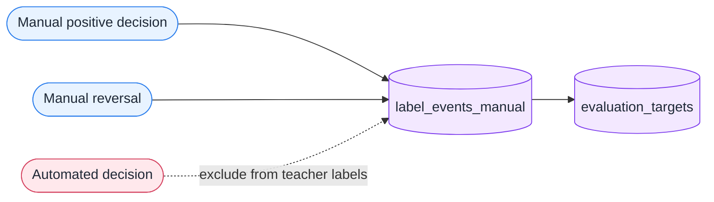

---

## 7. Negative Sampling

不正検知では、負例を作るのが難しい。「対応対象になっていない = 正常」とは単純に言えないからである。対応対象になっていない対象の中には、まだ見つかっていない不正対象、レビューされていない対象、検知対象外だった対象が含まれる可能性がある。

したがって、負例は「正常であると確定したもの」ではなく、「一定の条件から見て、おそらく正常とみなせる候補」として扱うのが現実的である。

MVPでは、作成から一定時間以上経過している、対応履歴がない、直近の活動量が極端に多くない、失敗イベントや否定的な反応が多くない、といった条件で stable negative candidate を選ぶ。この負例は完全な正常ラベルではないが、最初の評価を回すためには十分である。

ただし、この負例には bias がある。負例が安定しすぎていると、モデルが簡単に見分けられる評価になってしまう。将来的には、reviewer が確認して見送ったケースや、検知候補にはなったが対応されなかったケースを informative negative として扱うことも検討する。

---

## 8. Feature Rows

feature row は、ある対象のある時点における特徴量を1行にまとめたものである。評価基盤では、positive label と negative sample を合わせて evaluation target を作り、それぞれに対して feature row を作る。

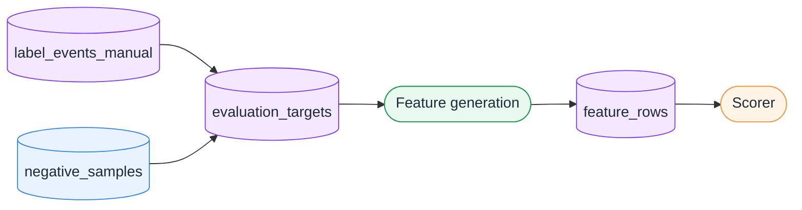

feature row は、scoring function との契約である。scoring function は、この契約に含まれるカラムだけを見て risk score を返す。

抽象例として、feature row は `entity_id`、`as_of_time`、`label_value`、`entity_age_minutes`、`activity_count_24h`、`event_count_1h`、`state_change_count_24h`、`source_count_24h`、`failed_event_count_24h`、`context_change_count_24h`、`negative_signal_rate_24h`、`event_ratio_1h`、`segment` のようなカラムを持つ。

feature schema は、feature builder と scorer の契約である。この契約が曖昧だと、scoring function が想定していない列欠落や型不整合で壊れる。そのため、評価基盤では feature row の検証を行う。

---

## 9. dbt Skeleton と SQLite Warehouse Simulation

dbt は特徴量値そのものを保存する道具ではなく、特徴量を作るSQL変換ロジックを管理・実行・テストする道具である。この設計書では、実 warehouse 接続や固有テーブルを前提にせず、dbt skeleton を feature generation SQL の概念的な置き場所として扱う。

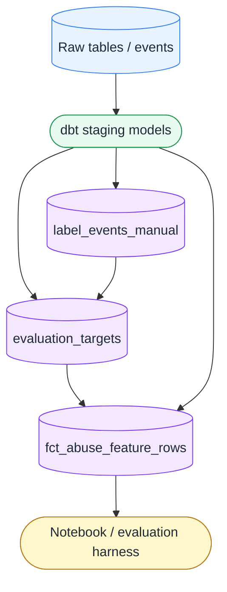

SQLite warehouse simulation は、warehouse に接続する前に、raw table から feature row を作る流れを小さく体験するための教材である。合成の entity attributes、entity activity logs、reviewer decision logs から label と feature row を作り、既存の evaluation harness へ流す。

この simulation により、`event_time < as_of_time` や `snapshot_time <= as_of_time` の意味を実際のSQLとして確認できる。

---

## 10. Evaluation Harness

Evaluation Harness は、scorer を過去データや fixture に適用し、性能を測る実行基盤である。これはモデルそのものではない。モデルやルールを育てるための実験装置である。

評価ハーネスは、feature rows を読み込み、feature schema を検証し、scoring function を適用して risk score を付ける。その後、threshold を動かし、precision / recall / TP / FP / FN を計算し、false positive と false negative を確認する。

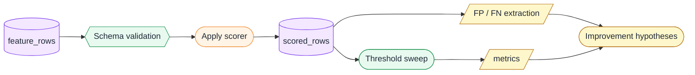

risk score は連続値である。ある score 以上を不正候補とみなすには threshold が必要になる。threshold を固定して1点だけを見ると、モデルやルールの性質を十分に理解できない。そのため、評価では threshold を複数動かす。

precision は「検知したもののうち、どれくらい本当に不正だったか」を表す。recall は「本当に不正だったもののうち、どれくらい検知できたか」を表す。不正検知では、threshold を上げると一般に precision は上がりやすく、recall は下がりやすい。誤対応を避けたい場面では precision を重視し、検知漏れを減らしたい場面では recall を重視する。

---

## 11. Error Analysis と Score Bucket Analysis

metrics だけを見ても、改善すべき点は分からない。たとえば precision が低い場合、false positive を確認する必要がある。高スコアなのに negative label だった対象を見れば、正常な大量利用対象を誤検知している、paid plan や workspace size を考慮すべき、特定の feature の重みが強すぎる、negative sample の作り方が悪い、といった仮説が立つ。

一方、false negative は positive label なのに低スコアだった対象である。これを見ることで、既存 feature では捉えられない攻撃パターンがある、新しいログ種別が必要、時間窓が長すぎるまたは短すぎる、label のタイミングと feature の as_of_time が合っていない、といった仮説が立つ。

score bucket analysis は、score の帯ごとに label 分布を見る方法である。0-20、20-40、40-60、60-80、80-100 のように bucket を切り、それぞれの positive rate を見る。これは、単一 threshold では見えない score の分布を理解するのに役立つ。

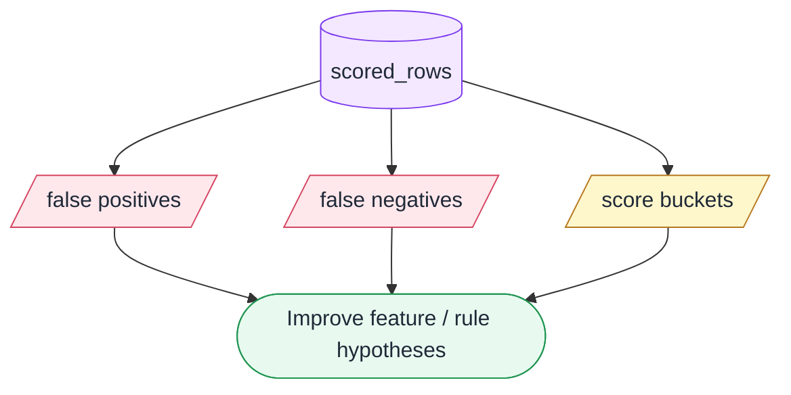

---

## 12. Notebook Workflow

Notebook は、運用システムではない。評価基盤における notebook は、評価ワークフローを手で回すための作業台である。

Notebook は、評価対象 window を決め、feature rows を読み込み、scorer を選び、score を付け、threshold sweep を実行し、metrics を表示し、FP/FN を見て改善候補をメモする場所である。

重要なのは、notebook に scoring logic の本体や大量の feature generation SQL を置かないことである。scoring logic は Python module に置く。feature generation は dbt / SQL に置く。notebook はそれらを呼び出して評価する。

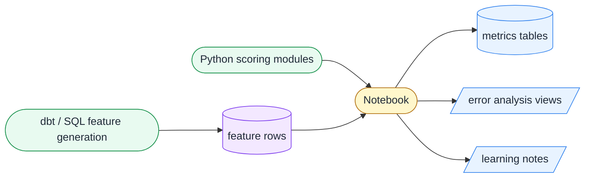

---

## 13. Rule-based Scorer と ML Baseline

最初の scorer は、手書きルールでよい。作成直後なら加点、`activity_count_24h` が多ければ加点、`event_count_1h` が多ければ加点、`state_change_count_24h` が多ければ加点、信頼できる segment なら少し減点、というような単純な ruleset で十分である。

評価基盤が整った後で、logistic regression のような単純な ML baseline を追加する。ML baseline は、同じ feature rows を使って学習し、risk score を返す。

ここで重要なのは、ML model も評価ハーネスから見ると scorer の一種にすぎないことである。RuleBasedScorer も MLModelScorer も、評価基盤に対しては feature row から risk_score を返す同じインターフェースを持つ。

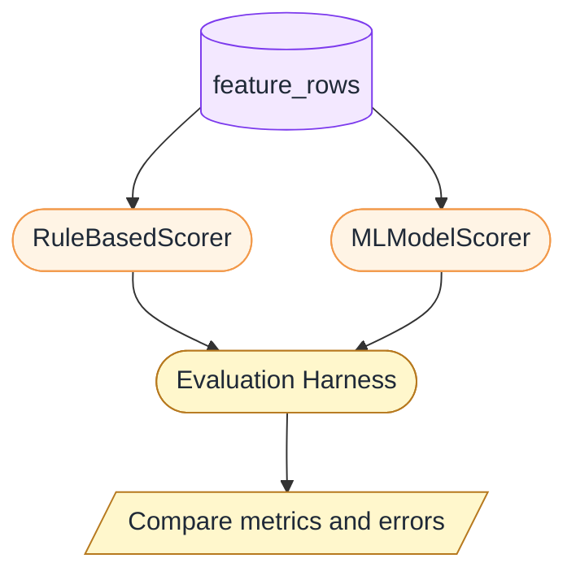

ML baseline を保存する場合は、model artifact だけでなく metadata も保存する。metadata には model_name、model_version、model_type、feature_columns、label_column、training_data、training_row_count、evaluation_threshold、precision_at_threshold、recall_at_threshold、created_at などを含める。

---

## 14. Score Source / Versioning と Evaluation Results

評価結果を比較するには、どの scorer が出した score なのかを明確にする必要がある。そのため、score には `score_source` と `score_version` を付与する。

たとえば、`score_source = rule_based`、`score_version = ruleset_v003`、または `score_source = ml_baseline`、`score_version = model_v001` のように残す。

MVPでは evaluation_results をテーブル化しなくてもよいが、継続的に scorer を改善するなら、評価結果を保存した方がよい。将来的な `evaluation_results` には、evaluation_run_id、eval_window_start、eval_window_end、score_source、score_version、feature_version、dataset_version、threshold、precision、recall、tp、fp、fn、created_at などを含める。

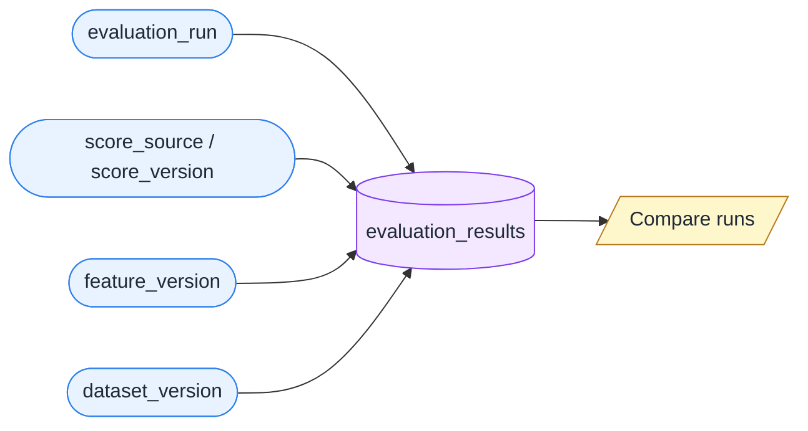

これにより、ruleset_v002 と ruleset_v003、model_v001 と model_v002、先月と今月、threshold 80 と threshold 90 のような比較ができる。

---

## 15. Rolling Window Evaluation と Calibration

不正検知では、攻撃者の行動が時間とともに変わる。そのため、ある月全体の平均 performance だけを見ると、短期間の劣化を見逃す可能性がある。

Rolling window evaluation は、評価期間を複数の時間窓に分け、それぞれで metrics を見る方法である。各 window で precision / recall を見ることで、ある週だけ recall が落ちている、新しい攻撃パターンに弱い、ある window だけ false positive が増えている、といった変化を把握できる。

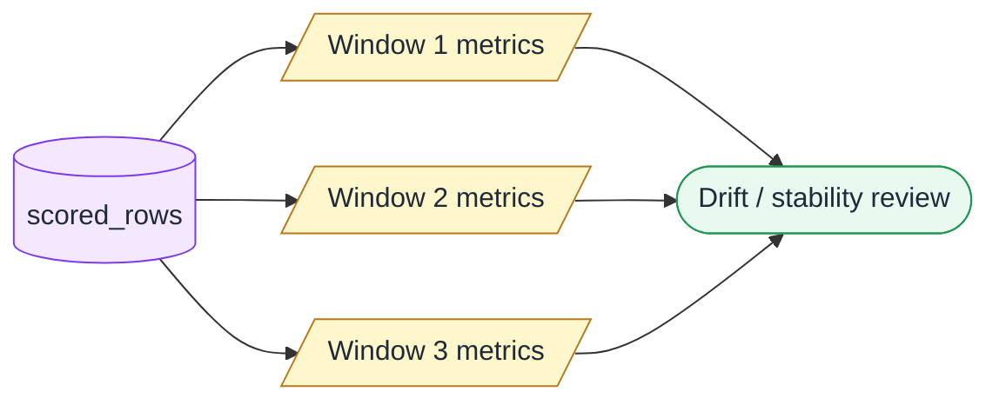

Calibration は、score を単なる順位ではなく、確率らしい値として解釈できるかを見る考え方である。たとえば、risk_score が 80 の bucket に入った対象のうち、実際に positive label が80%程度なら、score は確率らしく振る舞っていると言える。

ただし、初期の不正検知では、calibration は threshold sweep より後でよい。まずは、score が高いものほど不正らしいか、threshold をどこに置くと precision / recall がどうなるかを理解する方が重要である。

---

## 16. 評価基盤と運用スコアリングの接続

評価基盤は運用スコアリングと独立しているが、完全に切り離されているわけではない。

運用側では、Scoring Interface や batch scoring job が `score_results` を生成し、decision policy が `action_candidates` を作る。それらの結果は、将来的に評価基盤へ戻せる。

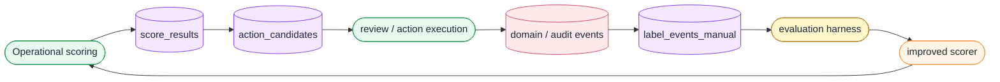

ただし、auto decision の結果をそのまま teacher label に混ぜてはいけない。運用側で生成された score や action candidate は、評価・分析には使える。しかし、教師ラベルの正例は原則として manual label から作る。この分離により、自己参照ループを避けながら、モデル改善のループを回せる。

---

## 17. 設計上の検討事項

評価基盤を運用に近づけるうえで、今後検討すべき論点がある。`label_events_manual` の最小 schema をどうするか、reversal handling をどのタイミングで入れるか、negative sampling をどの程度厳密にするか、informative negative をどう取り込むか、feature_version をどう管理するか、feature snapshot を保存するか recompute 前提にするか、evaluation_results をいつテーブル化するか、hold-out dataset をいつ導入するか、model registry / scorer registry をどう設計するか、manual review 結果をどう評価基盤へ戻すか、auto decision を teacher label に混ぜない仕組みをどう担保するか、などである。

---

## 18. まとめ

評価基盤の中心は、モデルを作ることではなく、scorer を継続的に評価し、改善できる状態を作ることである。

そのためには、label、feature、score、metrics、error analysis を分離する必要がある。`label_events_manual` は manual review による判断に基づく教師ラベル、`evaluation_targets` は評価対象の `entity_id + as_of_time`、`feature_rows` は `as_of_time` 時点で見えていた情報から作る特徴量、scorer は feature row から risk_score を返す部品、threshold sweep は score を decision に変換する前の性能確認、error analysis は FP/FN を見て改善仮説を立てるための作業である。

評価基盤があることで、ルールベース scorer も ML model も同じ枠組みで比較できる。さらに、運用スコアリングで生成された score_results や manual review 結果を評価基盤に戻すことで、検知ロジックを継続的に育てるループを作ることができる。

この設計は、SaaS 不正検知における MLOps のうち、特に evaluation、monitoring、iteration の中心部分に相当する。
