# Design Doc: SaaS不正検知 運用スコアリングアーキテクチャ

## 1. 目的

このドキュメントは、評価基盤で育てた scoring logic / ruleset / ML model を、運用寄りのアプリケーションとして利用する場合の設計を整理するものである。

対象は、SaaS における不正利用やスパム的な挙動の検知である。評価基盤では、feature row に scorer を適用し、risk score を出し、precision / recall や false positive / false negative を見ながら改善してきた。このドキュメントでは、その評価済み scorer を、reviewer 補助や自動・半自動対応のコンポーネントにどう接続するかを扱う。

中心となる流れは次である。

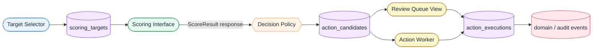

この設計では、scorer は直接対応しない。scorer はあくまで risk score を返す部品であり、その score を見て何をするかは decision policy が決める。対応候補の確認や dry-run の記録は、review interface や action worker が担う。

---

## 2. 全体像: Operational Scoring の3レイヤー

運用スコアリングは、次の3つのレイヤーに分けて考える。

1. Scoring Service Layer（スコア提供レイヤー）
2. Candidate Generation Layer（候補生成レイヤー）
3. Candidate Consumption Layer（候補利用レイヤー）

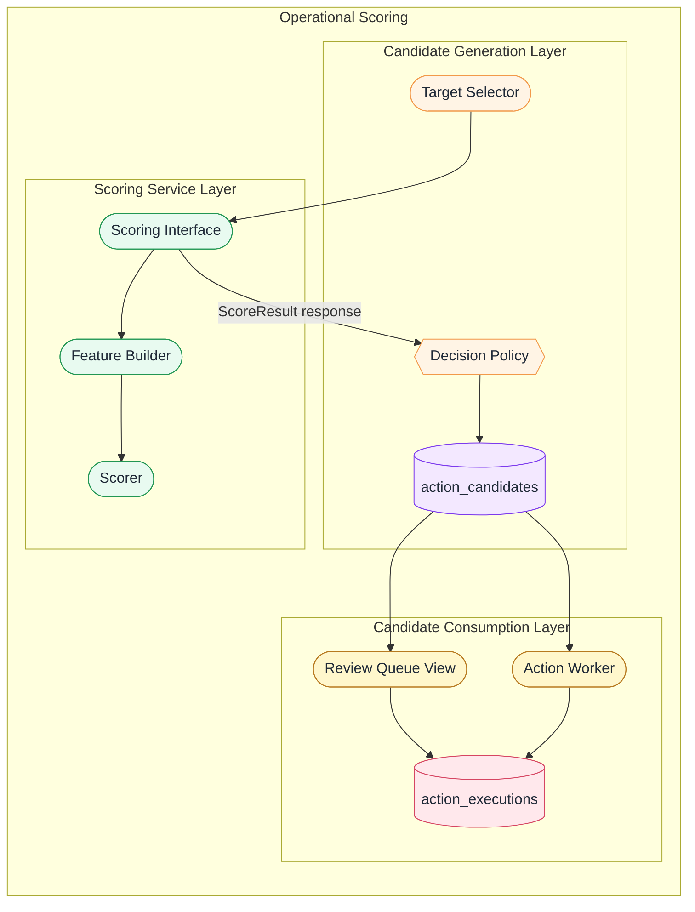

Scoring Service Layer（スコア提供レイヤー）は、`entity_id + as_of_time` から `ScoreResult` を返す。呼び出し側は feature row の作り方や scorer の内部実装を知らなくてよい。

Candidate Generation Layer（候補生成レイヤー）は、スコアリング対象を選び、Scoring Interface を同期的に呼び、API レスポンスとして受け取った `ScoreResult` を Decision Policy に通して `ActionCandidate` を作る。ここでは「後続対応の候補にするか」までを決める。

Candidate Consumption Layer（候補利用レイヤー）は、`ActionCandidate` を入力として、reviewer 向けの queue view や dry-run / guarded worker を動かす。ここでは候補をどう扱うか、skip するか、記録だけにするか、対応 request に進めるかを扱う。

この3レイヤーで分けると、score を作る責務、候補を作る責務、候補を使う責務が混ざりにくくなる。

---

## 3. 評価基盤との関係

評価基盤の中心は、`feature row -> scorer -> risk_score -> metrics` であった。運用スコアリングでは、この scorer を運用側コンポーネントから利用できる形にし、その出力を action candidate へ変換する。

評価基盤と運用シミュレーションは独立しているが、閉じた別世界ではない。運用シミュレーションで生成された score results、action candidates、reviewer による判断、対応や取り消しなどの domain/audit events は、将来的に評価基盤へ戻る。

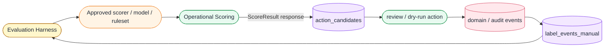

ただし、auto decision の結果を teacher label に混ぜてはいけない。運用側で生成された score や action candidate は評価・分析には使えるが、教師ラベルの正例は原則として manual label から作る。この分離により、自己参照ループを避けながら改善ループを回せる。

---

## 4. 設計原則

### 4.1 モデルは action しない

ML model / ruleset / scoring function は、直接対応処理を行わない。

scorer の責務は、feature row を受け取って risk score を返すことに限定する。

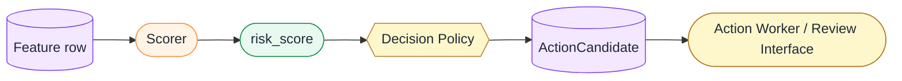

後続対応候補にするかどうかは、scorer の外側で決める。さらに、その候補を手動で扱うか、自動 worker が読むか、dry-run にするかは Review Queue や Action Worker 側で決める。これにより、同じ scorer を評価基盤、reviewer 補助、対応候補生成のいずれにも利用できる。

### 4.2 Scorer と Decision Policy を分ける

`risk_score >= threshold` は、あくまで候補化の条件であり、対応そのものではない。

Scorer は怪しさを推定する。Decision Policy は、その score を見て `action_candidate` か `no_action` かを決める。候補の強さは `candidate_priority` のような属性で表せるが、手動で処理するか自動で処理するかという How はここでは決めない。Action Worker や Review Queue は、その candidate を受けて後続処理を行う。

この分離により、threshold や業務条件だけを変えたい場合に、モデルや ruleset を再デプロイせずに policy を調整できる。

### 4.3 score は時点ごとの履歴である

同じ entity_id でも、24時間前の行動と現在の行動は異なる。したがって、score は対象に1つだけ持つ現在値ではなく、時点ごとの判定結果として扱う。

ScoreResult の単位は概念的には次の組み合わせである。これを永続化する場合、`score_results` は append-only の時系列ログになる。

```text
entity_id + as_of_time + score_source + score_version + feature_version + scoring_context
```

1日前は怪しくなかったが、今は短時間の活動量増加により怪しくなった、という変化は自然に発生する。その変化を表現するためにも、score は上書きする現在値ではなく、時点つきの結果として扱う。

### 4.4 action candidate は score ではない

`action_candidates` は score そのものではない。これは、ある ScoreResult を decision policy に通した結果、「後続対応の候補になった」という業務イベント寄りのデータである。

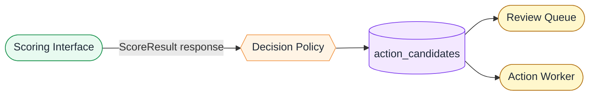

つまり、ScoreResult は scorer の出力であり、`action_candidates` は decision policy の出力であり、`action_executions` は reviewer または worker の実行結果である。`score_results` は主フローではなく、ScoreResult を永続化する場合の実装詳細として扱う。

---

## 5. Scoring Service Layer（スコア提供レイヤー）

Scoring Service Layer は、運用側コンポーネントに score を提供するレイヤーである。

主な入力は `entity_id + as_of_time` であり、主な出力は API レスポンスとしての `ScoreResult` である。このレイヤーの中に Feature Builder、Scorer、Scoring Interface が含まれる。監査・再処理・分析のために、実装詳細として `score_results` を残すこともある。

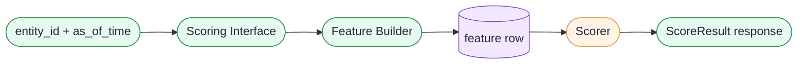

このレイヤーは、対象を探すこと、候補化すること、review queue の状態管理、action 実行を扱わない。それらは後続レイヤーの責務である。

### 5.1 Feature Builder

Feature Builder は、`entity_id + as_of_time` から feature row を作る。

運用側コンポーネントが特徴量定義を知ってしまうと、review interface と batch job で feature definition がずれたり、モデル更新時に複数コンポーネントを直す必要が出たりする。そのため、インターフェースはできるだけ `entity_id + as_of_time` に寄せ、feature row の構築は Scoring Interface またはその内側の Feature Builder に閉じ込める。

Feature Builder は、`event_time < as_of_time` や `snapshot_time <= as_of_time` を守り、未来情報を混ぜない。これは評価基盤と同じ point-in-time correctness の考え方である。

### 5.2 Scorer

Scorer は、feature row を受け取り risk score を返す部品である。

共通インターフェースは次のように考える。

```python
class Scorer:
    name: str
    version: str

    def score(self, features: dict) -> float:
        ...
```

RuleBasedScorer は ruleset や scoring function により score を返す。MLModelScorer は model artifact をロードし、probability を risk score に変換する。RemoteScoringClient は外部 Scoring Interface を呼び出して score を得る。

外側から見ると、ルールベースでもMLでも同じである。

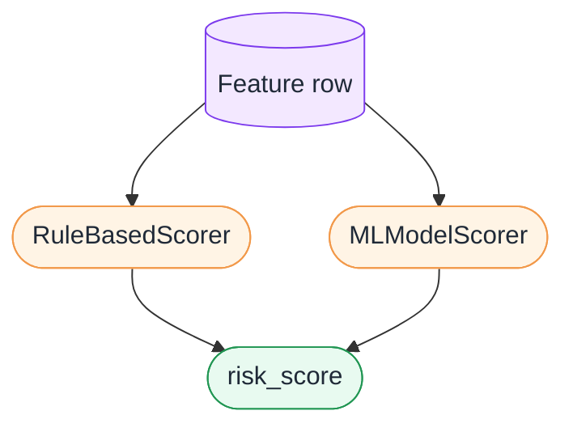

違うのは内部実装だけである。MLの場合は model artifact と model_version をデプロイし、ルールベースの場合は ruleset または scoring code と ruleset_version をデプロイする。

### 5.3 Scoring Interface

Scoring Interface は、運用側コンポーネントから score を取得するためのインターフェースである。

基本方針として、Scoring Interface は `entity_id + as_of_time` を受け取る。これにより、呼び出し側は feature row の作り方を知らなくてよい。

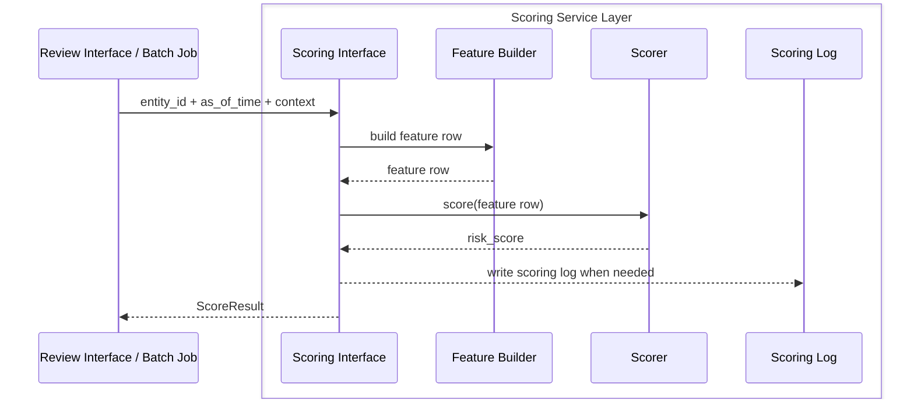

Scoring Interface は、entity_id と as_of_time から feature row を作り、scorer を呼び、ScoreResult を返す。必要に応じて `score_results` に保存する。

Scoring Interface に持たせる責務は、feature row の構築、scorer の呼び出し、ScoreResult の生成、score_source / score_version / feature_version / reason_codes の付与、必要に応じた scoring log の保存である。

一方、Scoring Interface に持たせない責務も明確にする。全対象から対象を探すこと、対応するかどうかを最終判断すること、message queue に積むこと、対応を実行すること、manual review の状態を管理することは、Scoring Interface の外側の責務である。

評価・debug・回帰テスト用には、feature row を直接受け取る入口を残してもよい。ただし、運用側コンポーネント向けの主インターフェースは `entity_id + as_of_time -> ScoreResult` とする。

### 5.4 ScoreResult

ScoreResult は、スコアリングの結果を監査・評価・運用で追跡可能な形にしたレスポンスオブジェクトである。永続化された行だけを指す言葉ではない。

```text
score_results
  score_result_id
  entity_id
  as_of_time
  risk_score
  score_source
  score_version
  feature_version
  feature_snapshot_id
  reason_codes
  scoring_context
  request_id
  scored_at
  created_by
```

`as_of_time` は、どの時点の対象状態として score したかを表す。`scored_at` は、scoring job や interface が実行された時刻を表す。たとえば、10:00時点の状態を10:03にスコアリングすることがあるため、この2つは分けて保持する。

ScoreResult は、Candidate Generation Layer には同期 API のレスポンスとして渡せる。別途、Scoring Service Layer は監査・debug・再処理のために同じ内容を scoring log として残すことがある。後から「なぜこの対象がレビュー対象または対応候補になったのか」を追うには、少なくとも request_id、score_version、feature_version、reason_codes を追跡できる必要がある。

### 5.5 Rule-Based と ML の差し替え

Scoring Interface は ML 専用 API ではなく、Scorer API として設計する。外側のインターフェースは `entity_id + as_of_time -> ScoreResult` であり、内部実装だけが異なる。

MLの場合は model artifact と model_version を使う。ルールベースの場合は ruleset / scoring_fn と ruleset_version を使う。Review Interface、Batch Job、Action Worker は、MLかルールかに依存しない形にできる。

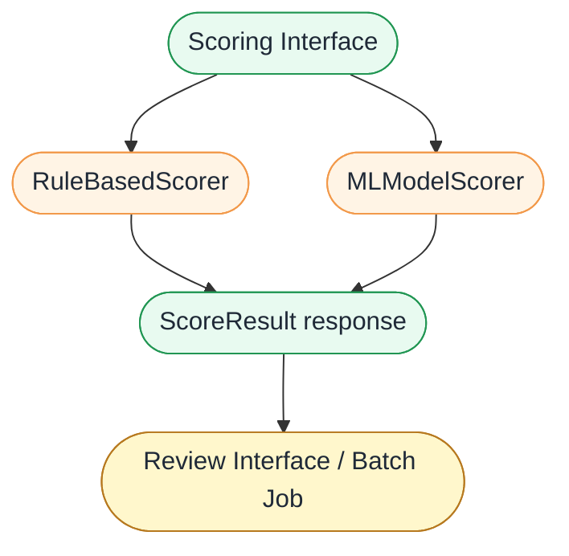

この抽象にしておくと、ルールベースからMLへ、またはMLからルール併用へ移行しやすい。さらに champion / challenger 運用もしやすくなる。champion は decision に使い、challenger は score だけ記録して比較する、という運用が可能になる。

### 5.6 score_results のログ設計

`score_results` は、ScoreResult response とは別に残す scoring log である。「この対象は、この時点で、この scorer/version により、この score だった」という事実を、監査・debug・評価への還流のために残す。

後続の Candidate Consumption Layer は `score_results` を主入力にしない。Review Queue View や Action Worker が読む主なデータは、Decision Policy の出力である `action_candidates` である。

object storage path は時間パーティションで切る。

```text
object://example-bucket/abuse_detection/score_results/dt=2026-05-05/hour=10/run_id=run_abc/part-000.parquet
```

`score_results` を保存する場合も、書き込み途中の partition と完了済み partition は区別する。そのため、各 partition には `_SUCCESS` または `manifest.json` を置き、分析・debug・評価還流では完了済み partition だけを参照する。

### 5.7 Scoring Service Layer のデプロイ単位

MLの場合、Scoring Service Layer に関係する主なデプロイ単位は Model build / evaluation / deployment pipeline、Model artifact / registry、Scoring Interface である。

Model build / evaluation pipeline は、feature rows と labels から model training、validation、evaluation、model artifact 作成、model registry への保存を行う。Scoring Interface は、registry から選ばれた model artifact、または ruleset / scoring code を使い、`entity_id + as_of_time` から Feature Builder と Scorer を経由して ScoreResult を返す。

---

## 6. Candidate Generation Layer（候補生成レイヤー）

Candidate Generation Layer は、Scoring Service Layer を利用して、後続対応候補を作るレイヤーである。

このレイヤーは、対象を選び、Scoring Interface を呼び、ScoreResult を Decision Policy に通し、ActionCandidate を出力する。ここでは「候補にするか」までを決めるが、「人間が処理するか」「worker が処理するか」「dry-run にするか」は決めない。

### 6.1 Target Selector

全対象に対して毎回スコアリングするのは非効率である。そのため、運用スコアリングでは scoring target を絞る。

Target Selector は、過去24時間に作成された対象、過去24時間に一定以上の活動があった対象、過去1時間に急増したイベントがある対象、直近で状態変更があった対象、対応済みではない対象、直近レビュー済みではない対象などを候補にする。

Target Selector の出力は `scoring_targets` である。

```text
scoring_targets
  target_id
  entity_id
  as_of_time
  target_reason
  target_source
  created_at
```

Target Selector のフィルターは効率化のためである。後続の Action Worker は、処理直前にも必ず現在状態を確認する。Target Selector が open entity だけを対象にしていても、worker 実行時点では既に reviewer により処理されている可能性があるためである。

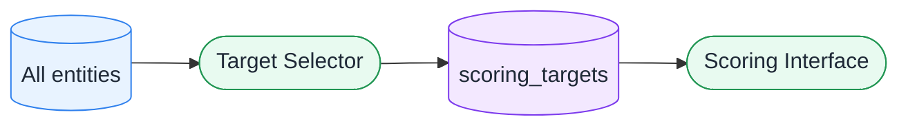

### 6.2 Decision Policy

Decision Policy は、ScoreResult を見て後続アクション候補を作る。

たとえば、risk_score が一定以上であれば `action_candidate`、それ以外は `no_action` とする。risk_score が非常に高い場合は `candidate_priority = high`、中程度に高い場合は `candidate_priority = standard` のように優先度を分けてもよい。ただし、手動対応にするか、自動 worker が読むか、dry-run / shadow mode にするかは、Review Queue や Action Worker など後段の責務として分ける。

Decision Policy の出力は ActionCandidate である。

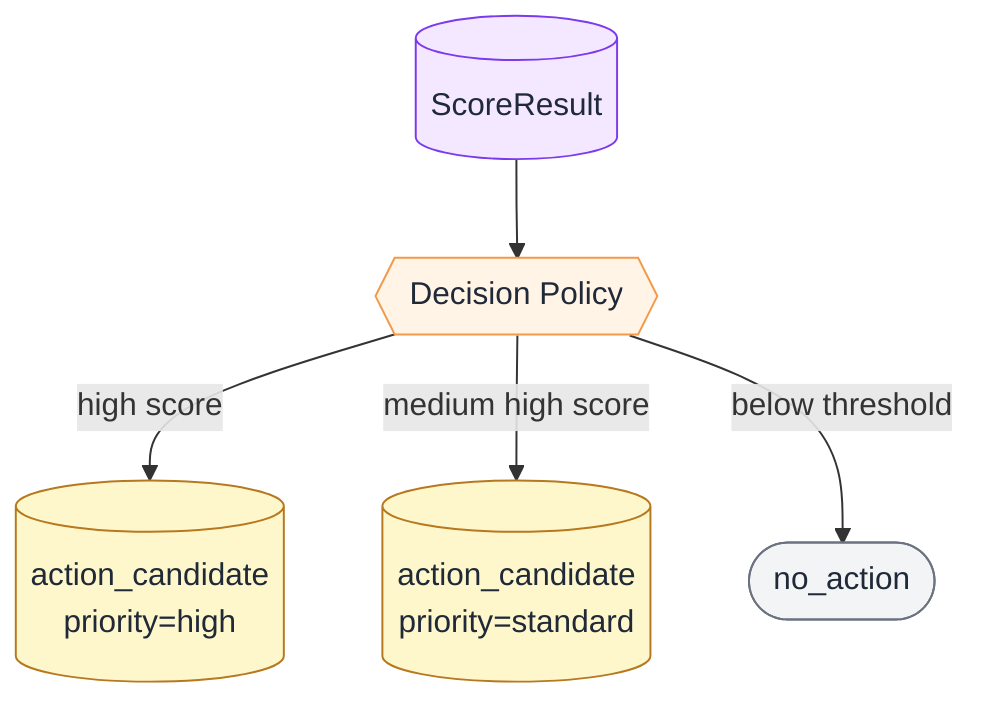

Decision Policy を scorer と分けておくことで、同じ score を使いながら候補化条件だけを調整できる。候補を人間レビューに回すのか、自動 worker が読むのか、shadow mode のみで記録するのかは、候補生成後の処理レイヤーで柔軟に変えられる。

### 6.3 ActionCandidate

ActionCandidate は、ScoreResult を Decision Policy に通した結果、後続対応の候補になったことを表す。

ActionCandidate は score そのものではない。ScoreResult は scorer の出力であり、action_candidates は decision policy の出力であり、action_executions は worker または reviewer の実行結果である。score_results は、ScoreResult を永続化する場合の scoring log である。

```text
action_candidates
  action_candidate_id
  score_result_id
  entity_id
  as_of_time
  risk_score
  decision
  decision_reason
  decision_policy_version
  candidate_priority
  score_source
  score_version
  feature_version
  candidate_status
  created_at
  expires_at
```

同じ entity_id でも、時間によって score は変わる。10:00には score が72で no_action、11:00には score が91で action_candidate priority=standard、12:00には score が98で action_candidate priority=high になるかもしれない。そのため、ActionCandidate も時系列で増える。

古い candidate は `superseded` にするか、UIやworker側で最新の open candidate だけを見る方針を持つ。candidate_status には、open、superseded、processing、processed、skipped、expired、failed などを持たせる。

### 6.4 action_candidates のデータ設計

`action_candidates` は、Decision Policy を通過した後続対応候補を表す第一級の operational data である。Review Queue View と Action Worker は、`action_candidates` を主入力として読む。

`action_candidates` には、「この ScoreResult は action_candidate になった」という事実だけでなく、候補の優先度、状態、期限、policy version、後続処理の起点になる identifier を持たせる。

```text
object://example-bucket/abuse_detection/action_candidates/dt=2026-05-05/hour=10/run_id=run_abc/part-000.parquet
```

object storage に出す場合は append-only に近い形で残せるが、これは単なる監査ログではない。候補利用レイヤーが読む system-of-record またはその materialized dataset として扱う。UI や worker が扱う現在状態は、必要に応じて `review_queue` のようなDBテーブルや message queue に同期する。

### 6.5 Candidate Generation Layer のデプロイ単位

Candidate Generation Layer の主なデプロイ単位は、Batch Scoring / Action Candidate Producer である。

Batch Scoring / Action Candidate Producer は、scheduled job として対象を抽出し、Scoring Interface を呼び、API レスポンスとして受け取った ScoreResult から `action_candidates` を作る。ScoreResult を `score_results` として保存するかどうかは Scoring Service Layer 側の logging 方針で決める。スコアリングと候補生成を1つの job にまとめることもできるが、概念としては scorer の出力と policy の出力を分けて扱う。

---

## 7. Candidate Consumption Layer（候補利用レイヤー）

Candidate Consumption Layer は、ActionCandidate を利用するレイヤーである。

このレイヤーには、reviewer が候補を見る Review Queue View と、候補を読み取って dry-run や対応 request を行う Action Worker が含まれる。主な入力は `action_candidates` であり、主な出力は `action_executions` や review state である。

### 7.1 Review Queue View

Review Queue View は、reviewer が高リスク候補を一覧で確認し、必要に応じて判断や対応 request を残すための view である。

これは単発で entity_id を入力して score を見る画面ではない。主入力は `action_candidates` またはそれを同期した `review_queue` である。

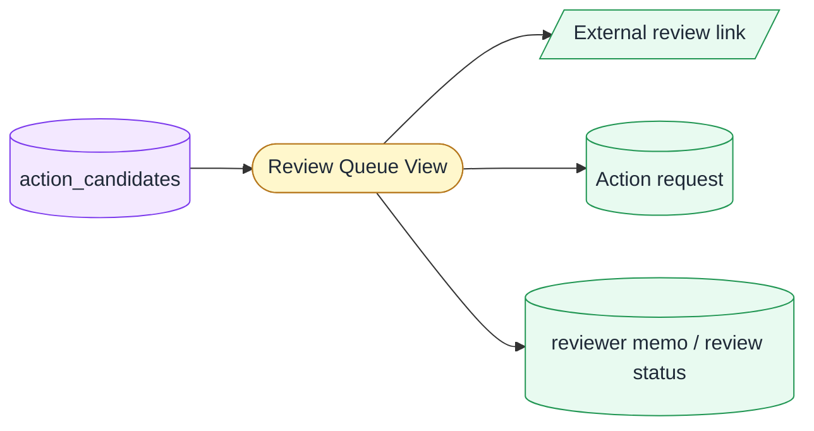

画面には、entity_id、risk_score、decision、decision_reason、status、scored_at、score_version、feature_version、review link、詳細表示、対応 request ボタンなどが並ぶ。

Review Queue View の責務は段階的に広げられる。最小責務は score と候補一覧の表示である。追加責務として、関連情報への review link、対応 request、権限・監査・安全弁つきの対応 request を扱う。

Review Queue View で、対応済み、保留、担当者、メモ、処理中 lock のような mutable な状態を扱う場合、object storageだけでは不十分になりやすい。そのため、object storage上の action_candidates は生成履歴として残し、UIの現在状態は `review_queue` のようなDBテーブルで管理するのが望ましい。

### 7.2 Action Worker

Action Worker は、ActionCandidate を読み取り、対応処理を行う。worker がどの候補を読むかは、`candidate_priority`、candidate_status、worker 側の設定、dry-run / shadow mode 設定などで決める。

worker は、ActionCandidate を読んだ後、処理済みか確認し、現在の entity status を確認し、open でなければ skip する。続いて safety guard を通し、dry_run ならログだけ出し、条件を満たす場合のみ対応処理または対応 request 作成を行う。

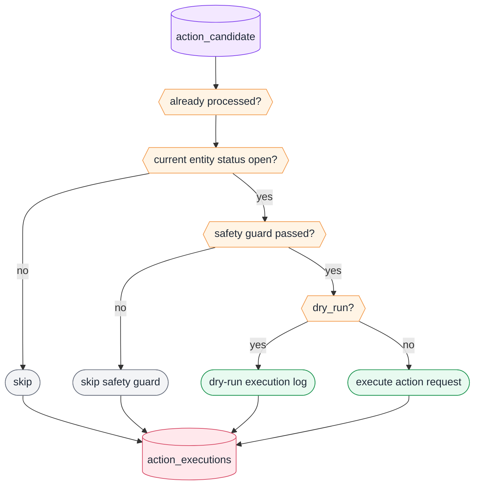

Scoring Job が open entity のみを対象にしていても、worker 実行時には状態が変わっている可能性がある。たとえば、10:00に scoring job が entity_123 を open と判断し、10:05に action_candidate を生成した後、10:10に reviewer が entity_123 を処理し、10:30に worker が candidate を読む、ということがあり得る。

この場合、worker は `skip_already_handled` として処理する。これは Time Of Check / Time Of Use の問題であり、scoring job 側の open filter だけに依存してはいけない。

### 7.3 action_executions のログ設計

`action_executions` は、worker または reviewer が実際に処理した結果である。「この action_candidate は、実際に対応された、skipされた、dry-runされた、失敗した」という事実を残す。

```text
object://example-bucket/abuse_detection/action_executions/dt=2026-05-05/hour=11/worker_run_id=worker_xyz/part-000.parquet
```

Action Worker が dry-run の場合でも、実行予定だった内容、skip reason、current status check の結果、idempotency key を `action_executions` に残す。これにより、実 action 前に worker の挙動を観察できる。

### 7.4 Safety / Guardrails

運用化では、dry_run flag、shadow mode、action_candidate_id、idempotency_key、current status check、already processed check、safety guard、skip reason logging、action_executions logging、score_source / score_version、decision_policy_version を必須に近い安全弁として扱う。

安全弁は、段階的な責務拡張として設計する。shadow mode では score と candidate だけを記録し、action は行わない。review assist では高リスク候補を reviewer に提示する。dry-run action worker では execution log だけを出力する。guarded automation では、限定条件、監視、rollback、audit が整った範囲だけ action request を扱う。

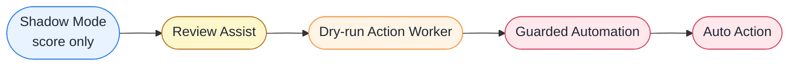

この段階導入により、誤対応のリスクを抑えながら運用シミュレーションへ近づけることができる。

### 7.5 Candidate Consumption Layer のデプロイ単位

Candidate Consumption Layer の主なデプロイ単位は、Review Queue View と Action Worker である。

Review Queue View は、`action_candidates` または `review_queue` を読み、reviewer が確認し、review link や action request を扱う。

Action Worker は、`action_candidates` または queue を読み、current status check、safety guard、dry-run、skip、action request などを処理し、`action_executions` を出力する。

---

## 8. レイヤー横断のログ・Queue・DB 設計

object storageには append-only の履歴ログを出す。主な出力は `score_results/`、`action_candidates/`、`action_executions/` の3種類である。ただし、`score_results` は Candidate Generation Layer への主経路ではない。Candidate Generation Layer は Scoring Interface の同期レスポンスとして ScoreResult を受け取り、`score_results` は監査・debug・再処理用の scoring log として別に残す。

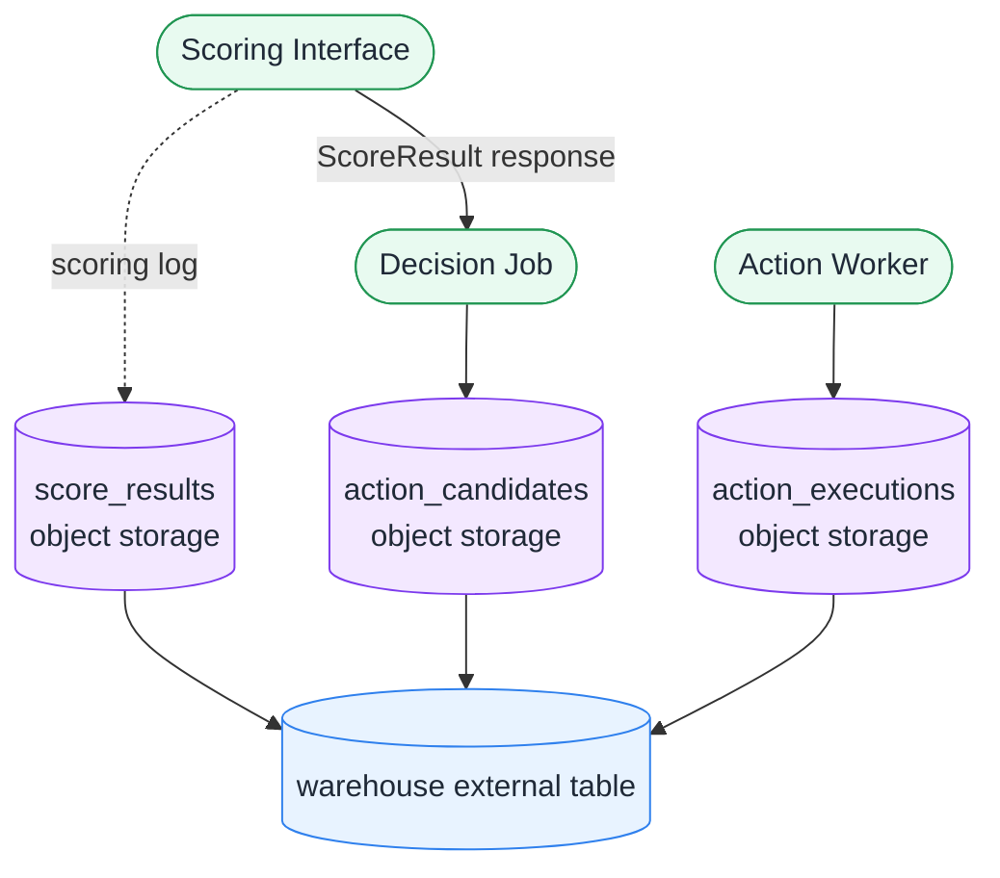

`score_results` は、スコアリングした履歴を残す optional な scoring log である。「この対象は、この時点で、この scorer/version により、この score だった」という事実を残す。

`action_candidates` は、Decision Policy を通過した後続対応候補を表す第一級の operational data である。Review Queue View や Action Worker はこれを主入力として読み、「この ScoreResult は action_candidate になった」という事実、優先度、状態、期限、policy version を参照する。

`action_executions` は、worker または reviewer が実際に処理した結果である。「この action_candidate は、実際に対応された、skipされた、dry-runされた、失敗した」という事実を残す。

object storage path は時間パーティションで切る。

```text
object://example-bucket/abuse_detection/score_results/dt=2026-05-05/hour=10/run_id=run_abc/part-000.parquet
object://example-bucket/abuse_detection/action_candidates/dt=2026-05-05/hour=10/run_id=run_abc/part-000.parquet
object://example-bucket/abuse_detection/action_executions/dt=2026-05-05/hour=11/worker_run_id=worker_xyz/part-000.parquet
```

後続の Review Queue View や Action Worker が読む主な対象は `action_candidates` である。worker や downstream job は、書き込み途中の `action_candidates` / `action_executions` partition を読んではいけない。そのため、各 partition には `_SUCCESS` または `manifest.json` を置き、完了済み partition のみを読む。

### 8.1 object storage、Queue、DB の役割分担

object storage hourly partition を worker が1時間ごとに読む構成は、batch 処理としては成立する。1時間程度の遅延を許容でき、即時性が不要で、dry-run / shadow mode から始めたい場合には有効である。

ただし、object storageは本来 queue ではない。そのため、完了マーカー、処理済み管理、冪等性、retry、DLQ相当、dry-run handling などを自前で補う必要がある。

本格化する場合は object storage + message queue のハイブリッドが堅い。

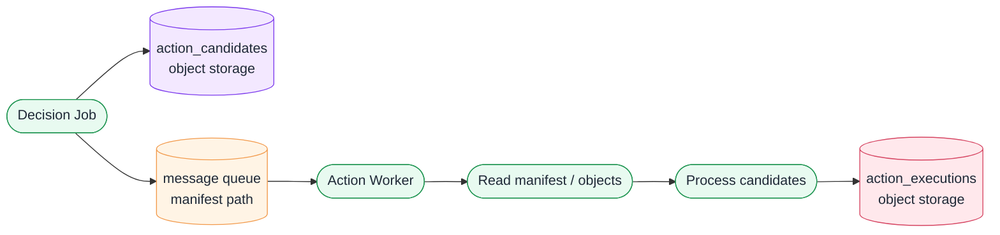

この構成では、object storageは監査・再処理・分析・履歴に強く、message queueは worker 通知・retry・DLQ・処理調整に強い。

Review Queue View が状態更新を行う場合、DB が必要になりやすい。object storage 上の `action_candidates` は後続処理の入力にもなる第一級データであり、DB は現在 open な review item、担当者、memo、review_status、lock 状態などの mutable な operational state を持つ。このように、候補データと現在状態を分ける。

### 8.2 Deployment Units の全体像

MLの場合の主なデプロイ単位は、Model build / evaluation / deployment pipeline、Scoring Interface、Review Queue View、Batch Scoring / Action Candidate Producer、Action Worker である。

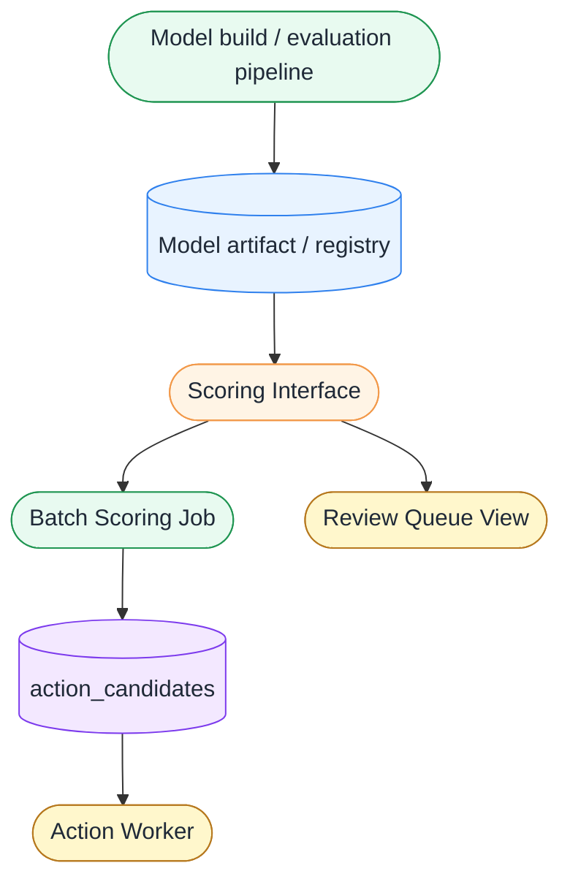

Model build / evaluation pipeline は、feature rows と labels から model training、validation、evaluation、model artifact 作成、model registry への保存を行う。

Scoring Interface は、entity_id + as_of_time から Feature Builder と Scorer を経由して ScoreResult を返す。

Review Queue View は、action_candidates または review_queue を読み、reviewer が確認し、review link や action request を扱う。

Batch Scoring / Action Candidate Producer は、scheduled job として対象を抽出し、Scoring Interface を呼び、ScoreResult response から action_candidates を作る。

Action Worker は、action_candidates または queue を読み、current status check、safety guard、dry-run、skip、action request などを処理し、action_executions を出力する。

---

## 9. 設計上の検討事項

今後設計を深めるべき論点は多い。feature snapshot をどこまで保存するか、Scoring Interface が score_results を保存するか呼び出し側が保存するか、Review Queue View の状態管理をどこに置くか、object storage hourly partition の遅延許容度をどう考えるか、message queue をいつ導入するか、action_candidate の expire / supersede 方針をどうするか、同一対象の複数 candidate をどう扱うか、manual review 結果を `label_events_manual` にどう戻すか、auto decision を teacher label に混ぜないための設計をどう担保するか、ruleset と ML model の champion / challenger 運用をどう行うか、といった論点である。

---

## 10. まとめ

運用スコアリングの中心は、評価基盤で育てた scorer を、reviewer 補助や自動・半自動対応へ安全に接続することである。

ScoreResult は時点ごとのスコアリング結果であり、`score_results` はそれを永続化する場合の scoring log である。`action_candidates` は decision policy により生まれた対応候補であり、`action_executions` は worker または reviewer による実行結果である。

Review Queue View も Action Worker も、第一級データである `action_candidates` を起点にできる。必要に応じて DB で現在状態を管理する。Scoring Interface は ML model / ruleset の違いを隠蔽し、`entity_id + as_of_time -> ScoreResult` を提供する。

この構造により、評価基盤で育てた scorer を、reviewer 補助、バッチスコアリング、自動対応候補生成へ、安全かつ段階的に接続できる。
