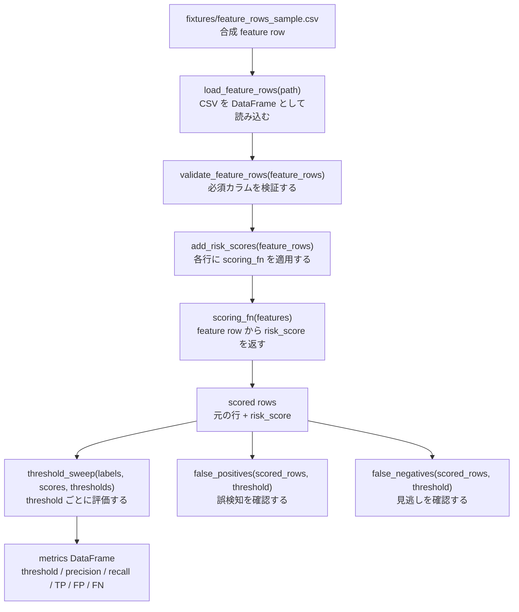
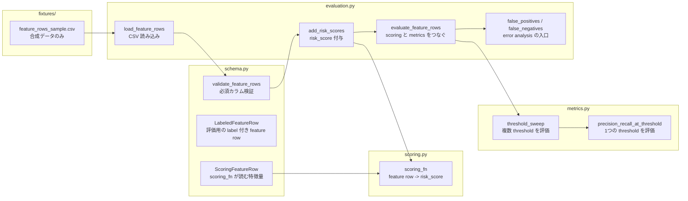
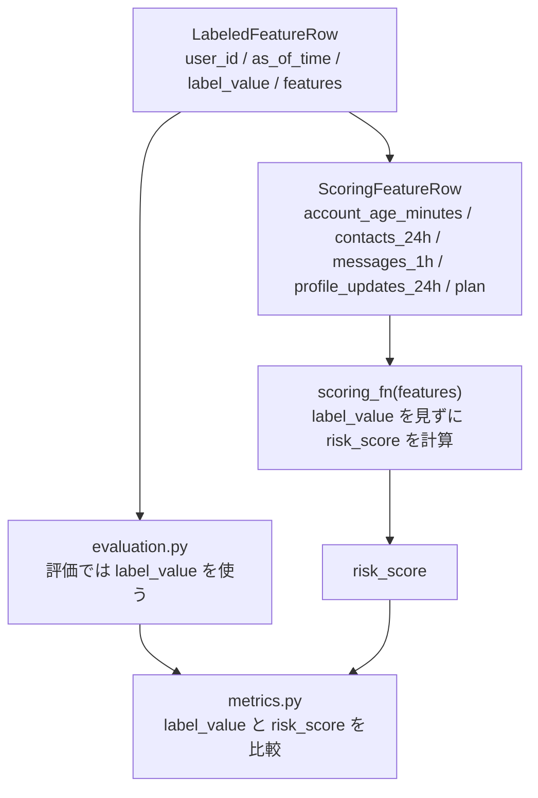
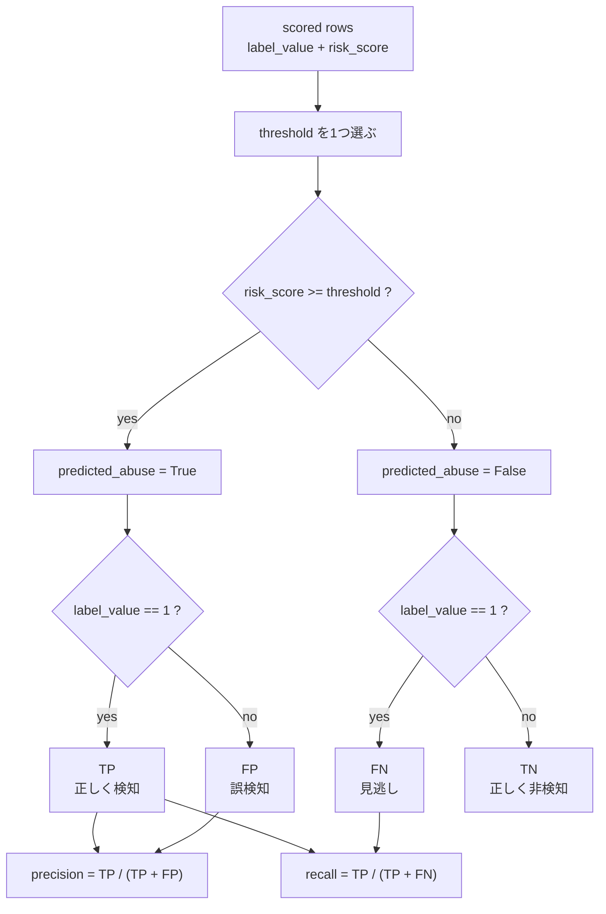
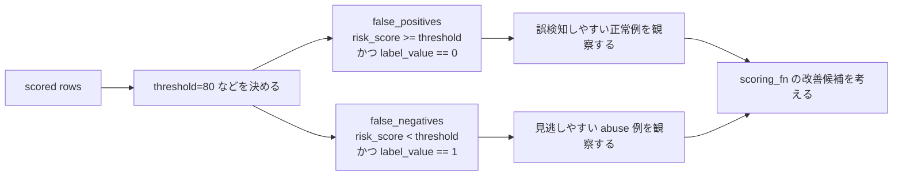

# Evaluation Flow

このドキュメントは、Phase 1 で実装した最小 evaluation harness の処理の流れを図で整理したものです。

目的は、次の流れをコードを読む前に掴めるようにすることです。

```text
feature row -> scoring_fn -> risk_score -> threshold sweep -> precision/recall -> error analysis
```

## 全体フロー



## 責務の分離



## 型とラベルの境界

`scoring_fn` は `ScoringFeatureRow` だけを受け取ります。

`ScoringFeatureRow` には `label_value` を含めません。これは、score を出す処理が正解ラベルを見ないようにするためです。



## threshold 評価

`risk_score >= threshold` の行を abuse と予測します。

threshold を変えると、precision と recall のバランスが変わります。



## error analysis の入口

Phase 1 では、まず false positive と false negative を取り出せるようにしています。

これにより、score や metrics の数字だけでなく、どの feature row を間違えたのかを確認できます。



## コードを読む順番

1. `fixtures/feature_rows_sample.csv`
2. `src/abuse_detection/schema.py`
3. `src/abuse_detection/scoring.py`
4. `src/abuse_detection/metrics.py`
5. `src/abuse_detection/evaluation.py`
6. `tests/`

この順番で読むと、データの形、入力契約、score 計算、評価指標、pipeline、テストの対応関係が追いやすくなります。

