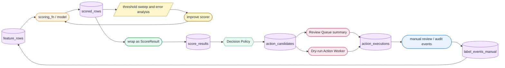

# Design Map

このメモは、`docs/design/` にある2本の設計ドキュメントと、このリポジトリの実装を対応づけるための地図である。

Phase 0〜7 では、評価基盤の流れを小さく実装した。Phase 8 では、その評価基盤が本番スコアリング運用のどこへ接続するのかを整理する。ここではまだ外部API、実DB、実停止処理、message queue は作らない。

---

## 1. 2本の設計ドキュメントの関係

`evaluation_harness_architecture_mermaid_ja.md` は、scorer を育てるための評価基盤を扱う。

```text
feature row -> scoring_fn / model -> risk_score -> threshold sweep -> metrics -> error analysis
```

`production_scoring_architecture_mermaid_ja.md` は、評価済み scorer を運用寄りの decision / review / dry-run action に接続する流れを扱う。

```text
ScoreResult -> Decision Policy -> ActionCandidate -> Review Queue / Dry-run Worker -> ActionExecution
```

この2つは別責務だが、閉じた別世界ではない。評価基盤で比較した scorer は、運用スコアリング側で ScoreResult を出す部品として使える。運用側で作られた score results、review 結果、action execution の履歴は、将来的に評価基盤へ戻して scorer 改善に使える。

ただし、自動判定や dry-run action の結果を teacher label に混ぜてはいけない。教師ラベルは、原則として human review などの manual label source から作る。

---

## 2. 評価基盤設計と既存実装の対応

| 設計上の概念 | このリポジトリでの対応 | 役割 |
| --- | --- | --- |
| Label source events | `dbt/models/labels/`、SQLite warehouse simulation、fixture の `label_value` | reviewer 判断や合成ラベルを、評価用 label として扱う |
| Evaluation targets | `dbt/models/features/evaluation_targets.sql`、SQLite export flow | `user_id + as_of_time` の評価対象を表す |
| Feature rows | `fixtures/feature_rows_sample.csv`、SQLite から export した CSV | scorer に渡す特徴量行 |
| Feature schema | `src/abuse_detection/schema.py` | feature row に必要な列を検証する |
| Scoring function | `src/abuse_detection/scoring.py` | feature row から `risk_score` を返す純粋関数 |
| ML baseline scorer | `src/abuse_detection/ml_baseline.py` | rule-based scorer と同じ評価基盤で比較する scorer |
| Scored rows | `src/abuse_detection/evaluation.py` の `add_risk_scores` の出力 | feature rows に `risk_score` と score metadata を付けたもの |
| Threshold sweep | `src/abuse_detection/metrics.py` | score を複数 threshold で判定し、precision / recall を計算する |
| Error analysis | `src/abuse_detection/error_analysis.py` | false positive / false negative を観察する |
| Rolling window evaluation | `src/abuse_detection/rolling_window.py` | 時間窓ごとの劣化や安定性を見る |
| Calibration | `src/abuse_detection/calibration.py` | score bucket ごとの positive rate を見る |
| Notebook workflow | `notebooks/` | 評価結果を手で観察する作業台 |
| Learning notes | `docs/learning/`、`docs/progress/` | 実装で学んだ設計意図を残す |

既存の評価基盤では、`evaluate_feature_rows` が中心になる。この関数は feature rows を読み、schema を検証し、scorer を適用し、scored rows と metrics を返す。

ここで得られる `scored rows` は、運用スコアリング側の `ScoreResult` に近い。ただし、まだ厳密な ID、append-only log、decision policy、action candidate は持っていない。

---

## 3. 運用スコアリング設計と次に作る概念の対応

| 設計上の概念 | Phase 9以降で作るもの | 役割 |
| --- | --- | --- |
| ScoreResult | `src/abuse_detection/production_schema.py` の `ScoreResult` | scorer の出力履歴。action ではなく、判断材料である |
| Decision Policy | `src/abuse_detection/decision_policy.py` | `risk_score` と policy 設定から decision を決める |
| DecisionResult | `production_schema.py` の `DecisionResult` | `action_candidate`、`no_action` などの判断結果 |
| ActionCandidate | `production_schema.py` の `ActionCandidate` | Decision Policy により生まれた後続対応候補 |
| Review Queue View | Phase 11 の `scripts/review_queue_summary.py` | open な action candidates を reviewer が見るための一覧 |
| Dry-run Action Worker | Phase 12 の `src/abuse_detection/action_worker.py` | action candidates を読み、dry-run execution log を残す |
| ActionExecution | Phase 12 の schema / log | worker または reviewer の処理結果。実停止ではなく simulation log |
| Append-only log | Phase 10 の `local_log_store.py` と `data_lake/` | score、candidate、execution を履歴として保存する |
| Feedback loop | Phase 13 の learning doc と fixture | manual review 結果を評価基盤へ戻す流れを整理する |

Phase 9 の最小実装では、既存の `risk_score` を `ScoreResult` に包み、Decision Policy で `ActionCandidate` に変換する。ここで重要なのは、scorer が直接 action しないことをコード上でも表すことである。

---

## 4. 評価基盤から運用スコアリングへ進む流れ



左側は Phase 0〜7 で実装済みの評価基盤である。右側は Phase 9 以降で小さく作る production scoring simulation である。

`scored_rows` と `score_results` は似ているが、目的が違う。`scored_rows` は評価作業の中間成果であり、threshold sweep や error analysis の入力になる。`score_results` は運用側で追跡可能な履歴であり、Decision Policy の入力になる。

---

## 5. `score_results`、`action_candidates`、`action_executions` を分ける理由

### `score_results`

`score_results` は scorer の出力履歴である。

同じ `user_id` でも、`as_of_time` が変われば feature row も score も変わる。そのため、score は対象に1つだけ持つ現在値ではなく、時点ごとの履歴として扱う。

ここには「怪しさの推定」を残す。レビューに回すか、自動対応候補にするか、何もしないかはまだ決めない。

### `action_candidates`

`action_candidates` は、Decision Policy が `ScoreResult` を見て作った後続対応候補である。

これは score そのものではない。score が高くても、dry-run 設定、plan、過去レビュー状態、safety guard、policy version によって candidate の扱いは変わる。

ここを分けると、scorer を変えずに policy だけ調整できる。また、同じ score を review assist、shadow mode、dry-run worker へ別々に接続しやすくなる。

### `action_executions`

`action_executions` は、worker または reviewer が candidate に対して実際に何をしたかの結果である。

この学習リポジトリでは実停止や外部API呼び出しはしない。Phase 12 では、dry-run で「実行したつもりのログ」や「skip reason」を残すだけにする。

この層を分けると、candidate が作られたことと、実際に処理されたことを混同しなくなる。Time Of Check / Time Of Use の問題、重複処理、既に処理済みの対象の skip もここで表現できる。

---

## 6. Phase 9 に入る前の設計メモ

Phase 9 では、次の最小単位から始める。

* `ScoreResult`: `user_id`、`as_of_time`、`risk_score`、`score_source`、`score_version`、`feature_version`、`scored_at`
* `DecisionResult`: `decision`、`decision_reason`、`decision_policy_version`、`candidate_priority`
* `ActionCandidate`: `score_result_id`、`user_id`、`risk_score`、`decision`、`candidate_priority`、`candidate_status`、`created_at`

最初の Decision Policy は、toy example として次の3段階でよい。

| 条件 | decision | 意味 |
| --- | --- | --- |
| `risk_score` が低い | `no_action` | 候補化しない |
| `risk_score` が中程度に高い | `action_candidate` + `standard` | 後続対応の標準優先度候補 |
| `risk_score` が非常に高い | `action_candidate` + `high` | 後続対応の高優先度候補 |

この段階では、候補を手動で扱うか、自動 worker が読むか、dry-run にするかは決めない。`ActionCandidate` はあくまで「後続対応候補である」という判断を表す。処理方法の詳細は Review Queue や Action Worker の責務として後段に分ける。
