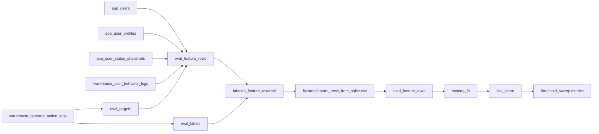

# Phase 3.5 Learnings: Local SQLite Warehouse

## 目的

Phase 3.5 では、Phase 3 の dbt skeleton で表した考え方を、ローカル SQLite で実行できる形にしました。

```text
synthetic app tables
  + synthetic warehouse tables
  -> human label source
  -> evaluation targets
  -> point-in-time feature rows table
  -> labeled evaluation rows
  -> existing evaluation harness
```

本番DB、社内DB、secret、実データには接続していません。

## 作ったもの

* `scripts/build_sqlite_warehouse.py`
  * `data/local_warehouse.sqlite` に合成 raw table を作ります。
  * `app_users`、`app_user_profiles`、`app_user_status_snapshots` を MySQL 由来のアプリDB相当として seed します。
  * `warehouse_user_behavior_logs`、`warehouse_operator_action_logs` を Snowflake / TD 由来の warehouse 相当として seed します。
  * `eval_feature_rows`、`eval_labels`、`eval_targets` を評価基盤側のテーブルとして作ります。

* `sql/sqlite/feature_rows.sql`
  * `user_id + as_of_time` の粒度で `eval_feature_rows` を作ります。
  * feature row 本体には `label_value` を入れません。
  * `event_time < as_of_time` によって、評価時点より未来の行動ログを特徴量に混ぜないようにしています。
  * `snapshot_time <= as_of_time` によって、評価時点で見えていたユーザー状態だけを使います。

* `sql/sqlite/human_label_source.sql`
  * human review / human suspend から `eval_labels` を作ります。
  * 自動検知による `auto_suspend_abuse` は teacher label に混ぜません。

* `sql/sqlite/labeled_feature_rows.sql`
  * 評価実行用に `eval_feature_rows` と `eval_labels` を join します。
  * この結果だけが `label_value` を持ち、既存 evaluation harness に渡されます。

* `scripts/export_sqlite_feature_rows.py`
  * SQLite で feature row SQL を実行し、`fixtures/feature_rows_from_sqlite.csv` を書き出します。

## 学び

feature row は、最初から存在するデータではありません。

raw table から評価したい時点を決め、その時点より前のeventと、その時点で見えていたユーザー状態を集計して作る評価用の行です。

## 現時点の全体アーキテクチャ

Phase 3.5 終了時点では、リポジトリ内に3つの層があります。

```text
1. Raw input layer
   app_* tables
   warehouse_* tables

2. Evaluation data layer
   eval_targets
   eval_feature_rows
   eval_labels

3. Python evaluation layer
   load_feature_rows
   scoring_fn
   threshold_sweep
```

SQLite は1ファイルですが、テーブルprefixで責務を分けています。

```text
app_*
  アプリDB由来のユーザー情報を表す
  実務では MySQL / PostgreSQL などにある想定

warehouse_*
  行動ログやオペレーター操作ログを表す
  実務では Snowflake / TD / BigQuery などにある想定

eval_*
  評価基盤側のテーブルを表す
  feature rows、labels、evaluation targets を管理する
```

現時点では、`eval_feature_rows` はSQLite内のテーブルとして作られます。これは実務でいう `fct_abuse_feature_rows` の小さい学習版です。

`eval_feature_rows` には `label_value` を入れません。feature row は scoring input であり、label は評価時にだけ必要な別データだからです。

## 現時点のパイプライン

現在の処理は、次の順番で流れます。

```text
scripts/build_sqlite_warehouse.py
  -> app_* と warehouse_* の合成raw tableを作る
  -> eval_targets を作る
  -> eval_labels を作る
  -> eval_feature_rows を作る

scripts/export_sqlite_feature_rows.py
  -> eval_feature_rows と eval_labels をjoinする
  -> fixtures/feature_rows_from_sqlite.csv を書き出す

src/abuse_detection/evaluation.py
  -> CSVを読み込む
  -> scoring_fnを各feature rowに適用する
  -> risk_scoreを付与する
  -> thresholdごとのprecision / recall / TP / FP / FNを計算する
```

図にすると、こうなります。



実運用では、ユーザーの基本情報やプロフィールは MySQL のような application DB にあり、行動ログやオペレーター操作ログは Snowflake / TD / BigQuery のような warehouse にあることが多いです。

この学習リポジトリでは物理的には単一 SQLite DB に入れていますが、テーブル名を `app_*` と `warehouse_*` に分けることで、入力データの性質を分けて読めるようにしています。

## テーブルの責務

`app_users` は、ユーザーの作成時刻、signup method、初期国などの基本属性を持ちます。

`app_user_profiles` は、プロフィール作成時刻、bio length、avatar upload などのプロフィール情報を持ちます。

`app_user_status_snapshots` は、plan、認証状態、profile completeness、account status など、時間で変わるユーザー状態のsnapshotを持ちます。feature rowを作るときは、現在値ではなく `snapshot_time <= as_of_time` の最新snapshotを使います。

`warehouse_user_behavior_logs` は、message sent、contact created、failed login などの行動eventを持ちます。feature rowを作るときは、`event_time < as_of_time` のeventだけを集計します。

`warehouse_operator_action_logs` は、human suspend、human review、auto suspend などのオペレーター操作を持ちます。このうち teacher label に使うのは human action だけです。

`eval_targets` は、評価したい `user_id + as_of_time` を持ちます。これは「どの時点の状態でスコアリングしたかったか」を表します。

`eval_feature_rows` は、`user_id + as_of_time` 粒度のfeature tableです。scoring inputなので、`label_value` は持ちません。

`eval_labels` は、human action から作ったlabel tableです。`label_time` と `as_of_time` を持ちます。

`labeled_feature_rows.sql` は、評価実行のために `eval_feature_rows` と `eval_labels` をjoinします。既存のPython evaluation harnessは `label_value` を必要とするため、このjoin結果をCSVとして渡しています。

## 実務運用への対応づけ

実務に寄せると、日次バッチは次のような形になります。

```text
Daily dbt job
  -> raw app / warehouse tables を読む
  -> fct_abuse_feature_rows を日次partitionで作る

Evaluation batch
  -> 対象期間の feature rows を読む
  -> 対象期間の labels を読む
  -> model_version / scoring_version を指定してscoreする
  -> scored rows と metrics を保存する
```

このリポジトリでは、dbtやSnowflakeの代わりにSQLiteとSQLファイルで同じ考え方を小さく再現しています。

```text
dbt model / Snowflake table
  -> このリポジトリでは sql/sqlite/*.sql と eval_* tables

fct_abuse_feature_rows
  -> このリポジトリでは eval_feature_rows

label events / review outcomes
  -> このリポジトリでは eval_labels

evaluation job
  -> このリポジトリでは export_sqlite_feature_rows.py + evaluate_feature_rows
```

現時点ではmetricsをSQLiteテーブルに保存していません。次の実務寄りの拡張では、`eval_runs`、`eval_scored_rows`、`eval_metrics` を追加すると、モデル改善ループに近づきます。

```text
eval_runs
  run_id
  model_version
  evaluated_from
  evaluated_to
  created_at

eval_scored_rows
  run_id
  user_id
  as_of_time
  risk_score
  predicted_abuse

eval_metrics
  run_id
  threshold
  precision
  recall
  tp
  fp
  fn
```

## Phase 3.5 で理解したこと

* feature row はraw dataそのものではなく、評価時点を基準に作る派生テーブル
* `as_of_time` は point-in-time correctness の中心
* 行動ログには `event_time < as_of_time` が必要
* 状態snapshotには `snapshot_time <= as_of_time` が必要
* app DB由来のユーザー情報と warehouse由来の行動ログは、feature rowで合流する
* `label_value` はscoring inputではないため、feature tableから分ける
* human label と auto action は分ける
* SQLite単一DBでも、`app_*` / `warehouse_*` / `eval_*` に分けると実務構成を学びやすい
* 既存 evaluation harness は、feature row CSVを受け取るだけなので、前段を fixture CSV から SQLite生成に差し替えられる

## 注意点

`label_value` は評価には必要ですが、`scoring_fn` が読んではいけない列です。

そのため、SQLite内では `eval_feature_rows` と `eval_labels` を分けています。`label_value` は評価用に join した後の `labeled evaluation rows` にだけ現れます。

今回も `scoring_fn` は feature row の行を受け取りますが、ルールは特徴量列だけを使います。label は threshold sweep と precision / recall の計算でだけ使います。

また、warehouse operator action logs には `auto_suspend_abuse` を含めていますが、human label source では `actor_type = 'human'` の行だけを使っています。これは、自動検知システムの判断を teacher label として混ぜないためです。

`account_status_as_of` は、現在のstatusではなく `snapshot_time <= as_of_time` の最新snapshotです。`suspended` のような状態は label に近いため、scoring feature として使うのではなく、評価対象の除外や監査用の文脈として扱います。

## 実行方法

```bash
python3 scripts/build_sqlite_warehouse.py
python3 scripts/export_sqlite_feature_rows.py
pytest -q
```
