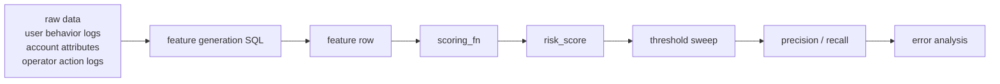
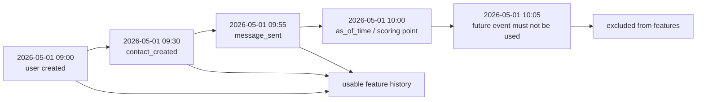
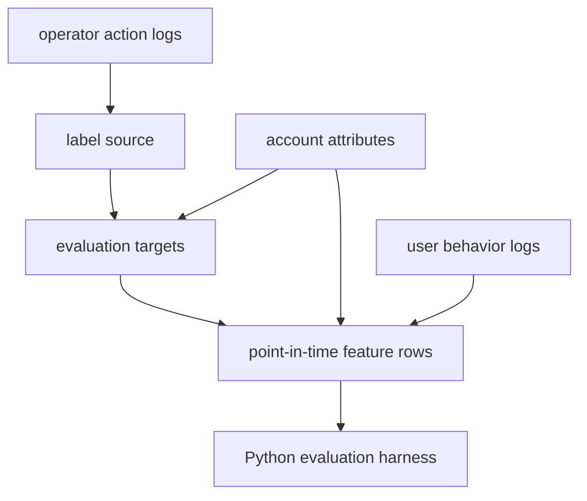
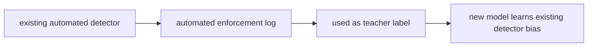
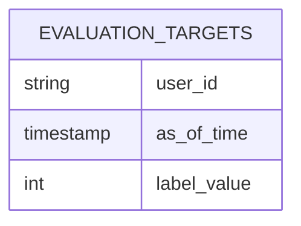
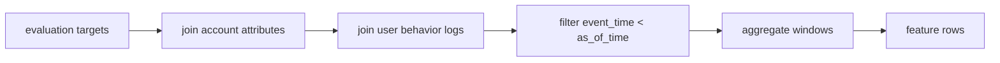
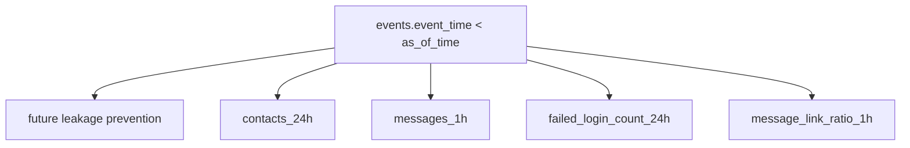
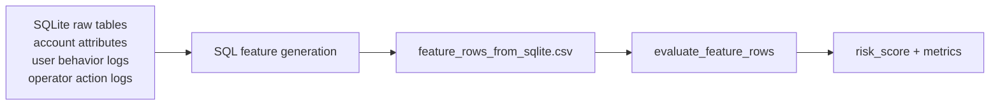
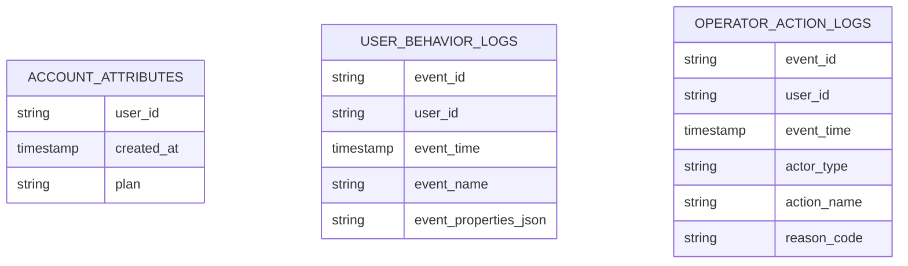
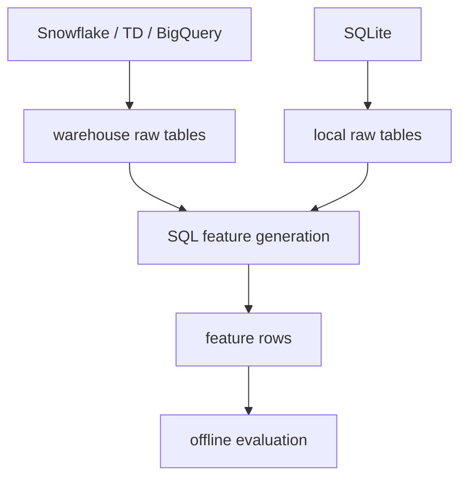

# Phase 3 Learnings

Phase 3 では、すでに完成した feature row を評価するだけでなく、その feature row がどこから来るのかを考えました。

Phase 1 と Phase 2 では、`fixtures/feature_rows_sample.csv` を前提にしていました。

しかし実運用では、最初から feature row が存在するわけではありません。

実際には Snowflake、Treasure Data、BigQuery、Redshift などの data warehouse に、ユーザー行動ログ、アカウント属性、オペレーター操作ログのような raw data があり、そこから SQL で評価用の feature row を作ります。

このリポジトリでは実DBに接続しないため、まず dbt skeleton で考え方を表現しました。

## 全体像

Phase 3 の関心は、次の前半です。



Phase 1 と Phase 2 は、主に `feature row` 以降を扱いました。

Phase 3 は、raw data から `feature row` を作る部分を学ぶためのフェーズです。

## Feature Row は時点つきの評価行

feature row は、単なるユーザー属性の一覧ではありません。

重要なのは、`user_id + as_of_time` の粒度です。

```text
user_id
as_of_time
label_value
account_age_minutes
contacts_24h
messages_1h
...
```

これは次の意味を持ちます。

```text
このユーザーを、この時刻時点で、何点と判断するか
```

そのため、feature は `as_of_time` より前に見えていた情報だけから作る必要があります。



`as_of_time` が 10:00 なら、10:05 の event を feature に混ぜてはいけません。

10:00 時点の detector は、10:05 の未来を知らないからです。

## 3つの責務

Phase 3 では、次の3つを分けて考えます。



1つ目は label source です。

これは「何を正解ラベルとして扱うか」を決めます。

2つ目は evaluation target です。

これは「どのユーザーを、どの時刻時点で評価するか」を決めます。

3つ目は point-in-time feature row です。

これは「その時刻時点で見えていた情報だけを使って feature を作る」処理です。

## Label Source

label source は、正解ラベルの元になるログです。

今回の skeleton では、オペレーターの確認・停止操作だけを teacher label にしています。

```sql
where actor_type = 'human_operator'
  and action_name in ('suspend_user', 'confirm_account_takeover', 'confirm_spam_account')
```

ここでは実装例として `actor_type = 'human_operator'` と書いていますが、抽象的には「人間のレビュー担当者が確認した操作ログだけを label source にする」という意味です。

自動検知システムの停止結果を teacher label に混ぜないことが重要です。

もし既存 detector の自動停止を正解として扱うと、新しい model が既存 detector の癖を学んでしまいます。



学ぶべきことは、label は「正解っぽいもの」を集めるだけではなく、「何を正解として扱うか」を設計する対象だということです。

## Evaluation Target

evaluation target は、評価対象の行を決めます。

粒度は `user_id + as_of_time` です。



たとえば、オペレーターが 2026-05-01 10:00 に abuse を確認したなら、positive target は次のように考えられます。

```text
user_id = synthetic_user_001
as_of_time = 2026-05-01 10:00
label_value = 1
```

このとき重要なのは、`label_value` は評価の答えとして使うが、`scoring_fn` や feature generation が label を見てはいけないことです。

## Point-in-time Feature Row

point-in-time feature row は、`evaluation_targets` を起点に作ります。



中心になる条件はこれです。

```sql
and events.event_time < targets.as_of_time
```

この条件により、未来情報の混入を防ぎます。

さらに、24時間 window や1時間 window の feature は、次のように作ります。

```text
contacts_24h:
  as_of_time より前、かつ as_of_time から24時間以内の contact_created を数える

messages_1h:
  as_of_time より前、かつ as_of_time から1時間以内の message_sent を数える
```



offline evaluation では、未来情報が混ざると性能が高く見えます。

しかし本番の予測時点ではその情報を使えないため、実運用では再現できません。

## SQLite Warehouse へ進む理由

dbt skeleton は、責務分離を理解するには有効です。

ただし、まだ実際に raw data から feature row を生成してはいません。

そこで次の段階として、Snowflake や Treasure Data の代わりに SQLite を小さな local warehouse として使う案が自然です。



SQLite で作る raw tables は、まず3種類で十分です。



これにより、次の問いを手元で確認できるようになります。

* この label はどの event から来たのか
* この `as_of_time` はどう決めたのか
* `contacts_24h` はどの期間を数えているのか
* 停止後の event が混ざっていないか
* 自動検知システムの判断を正解にしていないか

## 実運用との対応

SQLite を使っても、学ぶ構造は実運用と対応しています。



実運用に近づけるうえで大事なのは、特定の warehouse 製品に先に寄せることではありません。

まず、raw data から point-in-time feature row を作る流れを、ローカルで再現できることです。

## ここで理解する核心

Phase 3 で一番大事なのは、SQL の細かい構文ではありません。

重要なのは次の3つです。

```text
1. label は慎重に設計する
2. 評価対象は user_id + as_of_time で決める
3. feature は as_of_time より前の情報だけで作る
```

この3つが分かると、ML baseline に進んだときにも、次を疑えるようになります。

```text
このモデルは本当に予測しているのか
それとも未来情報や既存 detector の判断を見て当てているだけなのか
```

この感覚は、不正検知の評価設計でとても重要です。
