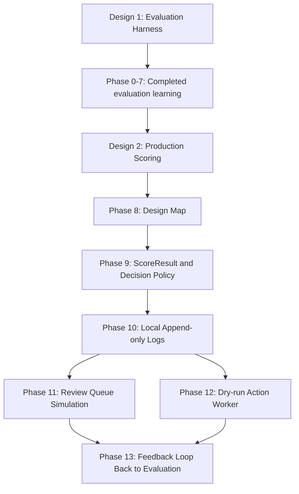

# Roadmap

このロードマップは、`docs/design/` にある2本の設計ドキュメントを理解するための学習順序を表します。

このリポジトリは本番システムではありません。実データ、顧客データ、社内データ、credential、本番検知ロジック、実際の停止ルールや閾値は使いません。合成データ、toy example、ローカルファイル、SQLite だけで、設計の責務分離を小さく再現します。

## このプロジェクトの新しい位置づけ

このプロジェクトの主目的は、SaaS 不正検知の本番アーキテクチャそのものを作ることではなく、`docs/design/` に書かれた設計を手元で理解することです。

`docs/design/` は、次の2段構成になっています。

1. `docs/design/evaluation_harness_architecture_mermaid_ja.md`
   * scorer をどう評価し、改善できる状態にするかを扱う
   * label、feature row、scoring_fn、risk_score、threshold sweep、error analysis、versioning、rolling window、calibration が中心

2. `docs/design/production_scoring_architecture_mermaid_ja.md`
   * 評価済み scorer を本番寄りの運用にどう接続するかを扱う
   * ScoreResult、Decision Policy、ActionCandidate、Review Queue、Action Worker、S3 append-only log、dry-run / shadow mode が中心

既存の Phase 0〜7 は、1本目の評価基盤設計を理解するための実装学習でした。今後は、2本目の本番スコアリング運用設計を理解するために、評価基盤で作った scorer / score を、本番寄りの decision / review / dry-run worker へ接続する流れを小さく再現します。



---

## Part 1: 完了済みの評価基盤学習

Phase 0〜7 では、次の流れをローカルで動かせるようにしました。

```text
feature row
  -> scoring_fn / ML scorer
  -> risk_score
  -> threshold sweep
  -> precision / recall
  -> false positive / false negative analysis
  -> iteration
```

この部分は、`docs/design/evaluation_harness_architecture_mermaid_ja.md` の理解に対応します。

### Phase 0: Project Setup

目的: 学習プロジェクトとして迷子にならないための土台を作る。

完了済みの主な成果:

* `README.md`
* `AGENTS.md`
* `docs/planning/roadmap.md`
* `docs/planning/tasks.md`
* `docs/progress/`
* `docs/process/pre_implementation_checklist.md`

### Phase 1: Minimal Evaluation Harness

目的: 合成 feature rows から risk_score を出し、threshold sweep で precision / recall を確認できる最小構成を作る。

完了済みの主な成果:

* `src/abuse_detection/schema.py`
* `src/abuse_detection/scoring.py`
* `src/abuse_detection/metrics.py`
* `src/abuse_detection/evaluation.py`
* `fixtures/feature_rows_sample.csv`
* evaluation harness のテスト

### Phase 2: Notebook Workflow

目的: 評価の流れを notebook 上で手で回し、結果を観察できるようにする。

完了済みの主な成果:

* `notebooks/01_evaluate_scoring.ipynb`
* threshold sweep の表
* threshold 80 の false positives / false negatives
* scoring_fn / feature 改善候補の観察

### Phase 3: dbt Skeleton

目的: 将来の特徴量生成 SQL の置き場所と、point-in-time feature row の考え方を表現する。

完了済みの主な成果:

* staging model skeleton
* `label_events_human`
* `evaluation_targets`
* `fct_abuse_feature_rows`
* `event_time < as_of_time` による未来情報混入防止の表現
* 自動検知システムの停止結果を teacher label に混ぜない方針

### Phase 3.5: Local SQLite Warehouse

目的: Snowflake や Treasure Data の代わりに SQLite を小さな local warehouse として使い、raw table から feature rows を作る流れを再現する。

完了済みの主な成果:

* synthetic raw tables
* operator action logs からの human label source
* evaluation targets
* point-in-time feature rows
* SQLite から feature rows CSV を書き出す script

### Phase 4: Error Analysis

目的: metrics だけでなく、誤検知と見逃しの中身から改善仮説を立てる。

完了済みの主な成果:

* false positive / false negative helper
* score bucket analysis
* error analysis notebook
* scoring_fn 改善メモ

### Phase 5: ML Baseline

目的: rule-based scoring_fn と、最小の ML-based scoring_fn を同じ evaluation harness で比較する。

完了済みの主な成果:

* logistic regression baseline
* ML model の `risk_score` 化
* rule-based scorer と ML scorer の比較
* saved model artifact / metadata

### Phase 6: Iteration Ideas

目的: scorer、feature、評価方法を小さく改善しながら、検知モデル育成パイプラインの理解を深める。

完了済みの主な成果:

* score_source / score_version
* negative sampling
* rolling window evaluation
* score calibration

### Phase 7: Practical Evaluation Improvements

目的: 評価を時間方向に広げ、future validation や window ごとの劣化を観察する。

完了済みの主な成果:

* timeseries fixture
* time-based train / validation split
* window ごとの precision drop 観察
* `docs/learning/learning_review.md`
* `docs/learning/production_gap_analysis.md`

---

## Part 2: `docs/design` 理解のための新しいロードマップ

ここから先は、`docs/design/production_scoring_architecture_mermaid_ja.md` を読むための学習に移ります。

中心となる流れは次です。

```text
scored rows
  -> ScoreResult
  -> Decision Policy
  -> ActionCandidate
  -> Review Queue simulation
  -> Dry-run Action Worker
  -> ActionExecution
  -> human review / business events
  -> label_events_human
  -> evaluation harness
```

重要なのは、scorer が直接停止しないことです。scorer は `risk_score` を返すだけです。停止候補にするか、レビューに回すか、何もしないかは Decision Policy が決めます。実際の処理は Review Queue や Action Worker の責務です。

---

## Phase 8: Design Map and Concept Alignment

目的: 既存実装と `docs/design/` の概念を対応づける。

評価基盤側の `feature row -> scorer -> risk_score -> metrics` と、本番スコアリング側の `ScoreResult -> Decision Policy -> ActionCandidate -> ActionExecution` をつなげて理解します。

### 作るもの

* `docs/learning/design_map.md`
* 既存ファイルと設計概念の対応表
* 評価基盤から本番スコアリング運用へ進む Mermaid 図

### 学ぶこと

* 評価基盤と本番スコアリングは別責務だが、閉じた別世界ではないこと
* `risk_score` は action ではなく、decision の入力であること
* `score_results`、`action_candidates`、`action_executions` を分ける理由
* auto decision を teacher label に混ぜない理由

### 完了条件

* `docs/design/` の2本がどうつながるか説明できる
* 既存の `evaluate_feature_rows` の出力が、どのように ScoreResult の入力になるか説明できる
* 次に実装する schema / dataclass の責務が明確になっている

### このフェーズでやらないこと

* 本番 API 実装
* 実停止処理
* S3 / SQS / DB への接続
* Streamlit などの UI 実装

---

## Phase 9: ScoreResult and Decision Policy Simulation

目的: 評価済み score を、本番寄りの decision に変換する最小構造を作る。

このフェーズでは、既存の scored rows を `ScoreResult` として扱い、Decision Policy に通して `review_required`、`auto_suspend_candidate`、`no_action` のような decision を返します。

### 作るもの

* `src/abuse_detection/production_schema.py`
* `src/abuse_detection/decision_policy.py`
* `tests/test_production_schema.py`
* `tests/test_decision_policy.py`

### 最小データ構造

* `ScoreResult`
  * `score_result_id`
  * `user_id`
  * `as_of_time`
  * `risk_score`
  * `score_source`
  * `score_version`
  * `feature_version`
  * `scored_at`

* `DecisionResult`
  * `decision`
  * `decision_reason`
  * `decision_policy_version`
  * `dry_run`

* `ActionCandidate`
  * `action_candidate_id`
  * `score_result_id`
  * `user_id`
  * `risk_score`
  * `decision`
  * `candidate_status`
  * `dry_run`
  * `created_at`

### 学ぶこと

* `risk_score >= threshold` は停止ではなく、候補化条件であること
* scorer と Decision Policy を分ける理由
* threshold や dry-run flag を scorer の外に置く理由
* review_required と auto_suspend_candidate の違い

### 完了条件

* ScoreResult から ActionCandidate を作れる
* high score は `review_required` または `auto_suspend_candidate` になる
* low score は `no_action` になる
* dry-run が default で安全側に倒れている
* scorer の実装を変更せず decision policy だけを変更できる

### このフェーズでやらないこと

* 本当に停止する処理
* 外部管理画面連携
* queue / worker
* DB 永続化

---

## Phase 10: Local Append-only Log Simulation

目的: S3 append-only log の考え方を、ローカルファイルで小さく再現する。

本番設計では、`score_results/`、`action_candidates/`、`action_executions/` を append-only の履歴ログとして保存します。このフェーズでは、実 S3 ではなく `data_lake/` 配下の JSONL で同じ考え方を学びます。

### 作るもの

* `src/abuse_detection/local_log_store.py`
* `scripts/build_action_candidates.py`
* `data_lake/score_results/`
* `data_lake/action_candidates/`
* log 出力のテスト

### ローカル path 例

```text
data_lake/score_results/dt=2026-05-06/hour=10/run_id=run_local/part-000.jsonl
data_lake/action_candidates/dt=2026-05-06/hour=10/run_id=run_local/part-000.jsonl
```

### 学ぶこと

* score は上書きする現在値ではなく、時点ごとの履歴であること
* action candidate は score そのものではなく、decision policy の出力であること
* append-only log は監査、再処理、分析に向いていること
* 書き込み完了 marker が必要になる理由

### 完了条件

* scored rows から score_results JSONL を出力できる
* score_results から action_candidates JSONL を出力できる
* `_SUCCESS` または `manifest.json` 相当の完了 marker を作れる
* 出力内容に `score_source` / `score_version` / `decision_policy_version` が含まれる

### このフェーズでやらないこと

* 実 S3 接続
* Parquet 最適化
* SQS 通知
* 大量データ処理

---

## Phase 11: Review Queue Simulation

目的: ActionCandidate を人間レビューの入口として見る。

Review Queue は、単に user_id を検索して score を見る画面ではありません。主入力は Decision Policy を通過した `action_candidates` です。このフェーズでは、最初は CLI または notebook で候補一覧を表示するだけにします。

### 作るもの

* `scripts/review_queue_summary.py`
* `notebooks/03_review_queue_simulation.ipynb` または CLI summary
* action candidate の filter / sort helper

### 学ぶこと

* Review Queue の主入力が `action_candidates` であること
* risk_score 順、decision 順、candidate_status 順に見る意味
* review_required と auto_suspend_candidate を同じ画面で扱う場合の違い
* UI の mutable state と append-only log は責務が違うこと

### 完了条件

* open な action candidates を一覧できる
* risk_score 降順で並べられる
* `decision` / `candidate_status` で filter できる
* 外部管理画面 link は placeholder として表現できる
* 実停止処理につながっていない

### このフェーズでやらないこと

* 本格 UI
* 認可
* 実管理画面連携
* reviewer assignment
* DB を使った mutable review state

---

## Phase 12: Dry-run Action Worker Simulation

目的: ActionCandidate を worker が読む場合の安全弁を理解する。

Action Worker は、candidate を読んで即処理するだけでは不十分です。処理済み確認、現在状態確認、safety guard、dry-run、skip reason logging が必要になります。このフェーズでは実停止を行わず、dry-run の `ActionExecution` ログだけを出します。

### 作るもの

* `src/abuse_detection/action_worker.py`
* `scripts/run_dry_run_worker.py`
* `data_lake/action_executions/`
* dry-run worker のテスト

### 学ぶこと

* scoring job 時点と worker 実行時点で account status が変わり得ること
* Time Of Check / Time Of Use の問題
* already processed check と idempotency が必要な理由
* dry-run は本番化前の安全な学習段階であること

### 完了条件

* action_candidates を読み込める
* `dry_run = true` の場合は実処理せず execution log だけ出せる
* 既に処理済みの candidate を skip できる
* current status が open でない candidate を skip できる
* skip reason を `action_executions` に残せる

### このフェーズでやらないこと

* 実停止
* 外部 API 呼び出し
* retry / DLQ の本格実装
* SQS worker

---

## Phase 13: Feedback Loop Back to Evaluation

目的: 本番寄りの scoring / decision / review 結果を、評価基盤へ戻す考え方を理解する。

本番設計では、score_results、action_candidates、action_executions、人間レビュー結果、停止・再開などの business events が、将来的に label source や evaluation target に戻ります。ただし、自動判定結果を teacher label に混ぜてはいけません。

### 作るもの

* `docs/learning/production_to_evaluation_feedback.md`
* synthetic review result fixture
* human review result から `label_events_human` 相当を作る toy flow

### 学ぶこと

* score_results は評価・分析に使えるが teacher label ではないこと
* action_candidates も teacher label ではないこと
* human review / human action を label source として扱う理由
* reversal handling を設計に残す理由

### 完了条件

* score / candidate / execution / human label の違いを説明できる
* auto decision を teacher label に混ぜない流れを図解できる
* human review result から評価基盤へ戻る toy flow を説明できる

### このフェーズでやらないこと

* 本番 review log の取り込み
* 実データの label 作成
* 自動停止結果を正例として学習すること

---

## Optional Phase: Scoring API Shape

目的: 本番設計に出てくる Scoring API の外形だけを理解する。

このフェーズは必須ではありません。先に batch / local file simulation で ScoreResult と ActionCandidate の責務を理解してからで十分です。

### 作るもの

* `docs/design/scoring_interface_shape.md`
* `user_id + as_of_time -> ScoreResult` の疑似インターフェース
* feature row を直接受け取る debug entrypoint の整理

### 学ぶこと

* 本番アプリケーションが feature row の作り方を知らなくてよい理由
* Scoring API が持つ責務と持たない責務
* batch scoring / review app / evaluation debug で入口が違うこと

---

## 進め方の原則

### 1. `docs/design` から逆算する

新しい機能を足す前に、どの design doc のどの概念を理解するための実装かを明確にします。

### 2. scorer は action しない

`scoring_fn` や ML scorer は `risk_score` を返すだけに保ちます。レビュー候補化や停止候補化は Decision Policy の責務です。

### 3. 実停止につながる処理を作らない

このリポジトリでは、実停止、実ユーザー操作、実管理画面連携、外部 API 呼び出しは行いません。worker simulation は必ず dry-run にします。

### 4. append-only log と現在状態を混ぜない

`score_results`、`action_candidates`、`action_executions` は履歴ログとして扱います。Review Queue の担当者、メモ、処理中 lock のような mutable state は別責務として考えます。

### 5. auto decision を teacher label にしない

自動判定や action candidate は、評価や監査には使えます。しかし teacher label の正例は、原則として human review / human action から作ります。

### 6. public repo 前提で安全にする

会社名、実案件、実データ、実運用上の検知条件、credential、secret は書きません。設計理解に必要な情報は、抽象化した toy example で表現します。

---

## 現時点の優先順位

次は、次の順番で進めます。

1. Phase 8 で `docs/design` と既存実装の対応表を作る
2. Phase 9 で ScoreResult / Decision Policy / ActionCandidate を最小実装する
3. Phase 10 で local append-only log を作る
4. Phase 11 で review queue を CLI または notebook で眺める
5. Phase 12 で dry-run action worker を作る
6. Phase 13 で human review 結果を評価基盤へ戻す流れを整理する

この順番にする理由は、`docs/design/production_scoring_architecture_mermaid_ja.md` の本文が、Scoring API / ScoreResult / Decision Policy / ActionCandidate / Review Queue / Action Worker / feedback loop という依存関係で続いているためです。
